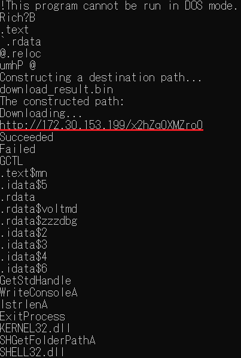

## Downloader (280pt / 45 solves) [★☆☆☆]
> バイナリ解析には様々な方法があります。
> 
> 
> 配布実行ファイルは特定のURLへ通信する機能を持ちます。通信先URLをそのまま回答してください。`flag{}`は不要です。
> 
> 
> 回答例: http://198.51.100.1/path
> 
> 
> 問題ファイルをダウンロード: Downloader.zip
> 
> ZIPのパスワード: `CybersecurityChallenge`
> 
> ZIPのハッシュ値(SHA256): `c4a324071b98b687334b442f664bcd8fa5679b583e5f264f5a5c6bb45ed4caaf`
> 
> 
> ヒント  
> バイナリ解析の最初には、表層解析を行うことが多いです。

zipの中に入っているのはPE形式のバイナリ。`strings`で一発だった。

</img>

### `http://172.30.153.199/x2hZq0XMZro0`