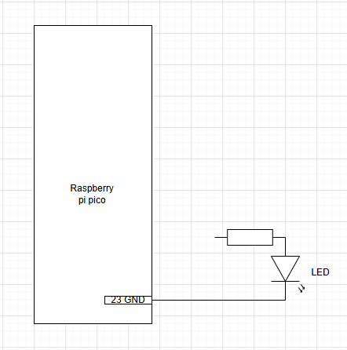
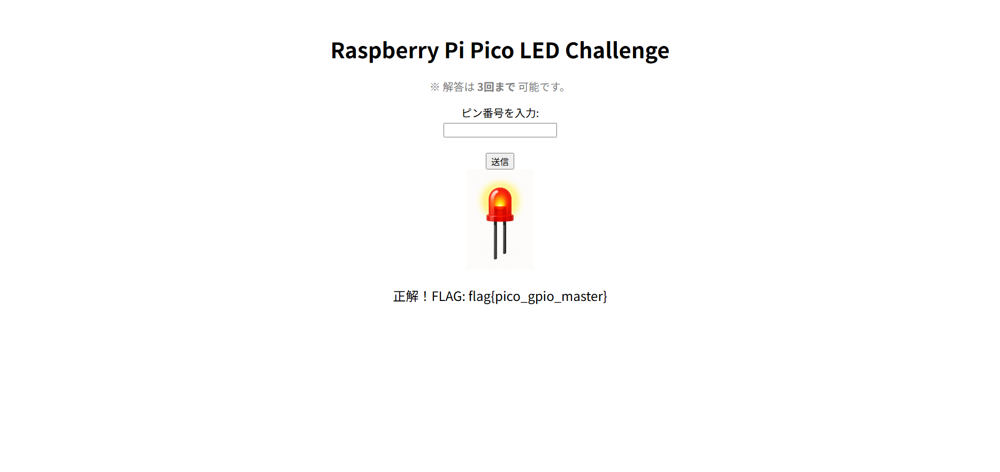

## Lamp (310pt / 39 solves) [★★☆☆]
> あなたはハードウェアエンジニアとして、Raspberry Pi Picoを用いてLEDを点滅させる簡単な電子回路を作成してほしいと依頼されました。  
> 使用するプログラムと製作中の回路図のみ渡されています。  
> 途切れている配線をRaspberry Pi Picoのどの物理PIN（物理PINは1から40まで存在する）に繋げばLEDが光るかを調査してください。  
> Webサイトで正解のPIN番号を入力する事でフラグを取得できます。  
> ※PIN番号が100番の場合、入力は半角で`100`のみ入力してください。  
> ※ピン番号の入力の解答回数は3回までとします。  
>
>
> 本問題のターゲットマシンを起動してください。起動が完了したら、VPN接続マシンまたはBrowser Kaliから `http://<ターゲットのIP>:8110` へ接続してください。
>
>
> 問題ファイルをダウンロード: Lamp.zip
>
> ZIPのハッシュ値(SHA256): `4deed859d0e9f87f9759134bb807f279a627addf5b4c8c0aa58a2cd1f39a4295`
>
>
> ヒント
> - Raspberry Pi Picoのピン配置とそれぞれの役割を調べてみましょう
> - `Pin`関数の使い方を調べてみましょう

使用するプログラムと製作中の回路図を以下に示す。
```python
from machine import Pin
import time

led = Pin(18, Pin.OUT)

while True:
    led.value(1)
    time.sleep(1)
    led.value(0)
    time.sleep(1)
```

</img>

回路図より、GNDには既に接続済みであることが分かる。`Pin(18, Pin.OUT)`という字面だけを見ると`18`が正解かと思ってしまいそうだが、`Pin()`がどんな関数かもわからない状態で決めつけるのは早計だと考えた。  
この回路及びプログラム自体は簡単なLチカなので、「Raspberry Pi Pico Lチカ」で検索するなりして調べてみると、[この記事](https://tool-lab.com/raspberrypi-startup-26/)がとても役に立った。~~というかほぼ答えが書いてある~~  
結論から言うと、`Pin()`の第一引数で指定する数字はGPIOの番号であり、基板上のPIN番号≠GPIO番号であるため、どの番号のPINに接続しなければならないかを知るためにはピンアウトをちゃんと見る必要がある。Raspberry Pi Picoでは、GPIO18は24番PINと対応しているので、`24`が答えとなる。  
これをWebサイトに入力すると無事フラグが得られた。（なお解答できる回数に制限があるものの、インスタンスを立ち上げ直せば残り回数はリセットされるらしい）

</img>

### `flag{pico_gpio_master}`