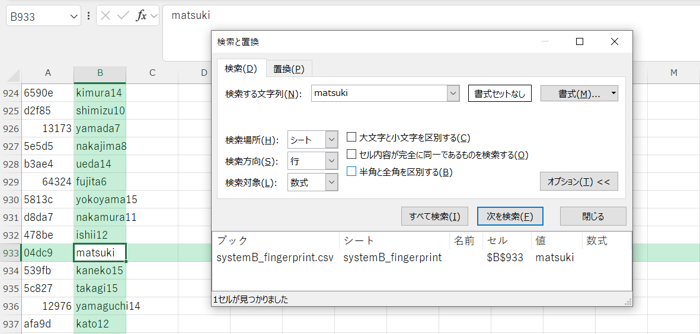

## Salted Hash Hunt (340pt / 33 solves) [★★☆☆]
> あなたは情報セキュリティ研究者として、最近発生した2つのシステム漏洩事件の調査を依頼されました。幸いなことに、これらの漏洩データは**単独では復元不可能**な形式で保存されていましたが、両方のデータセットを**組み合わせることで**パスワードを特定できる可能性があります。
>
>
> 調査の目標は、ターゲットユーザー `matsuki` の平文パスワードを特定することです。
>
>
> 問題ファイルをダウンロード: salted-hash-hunt.zip
>
> ZIPのハッシュ値(SHA256): `f11a69e79b6cc9c2d23fbe8baca042a6aecc50c016ddb27b86444bbb807386ca`
>
>
> **流出データ形式**
>
> **System A: 認証システム**
> 
> ファイル: `systemA_auth.csv`
> 
> - フォーマット: `salt_hex,iter,hash`
> - salt_hex: 5バイト（10桁の16進数）
> - iter: 反復回数（10,000または1,000,000）
> - hash: PBKDF2-HMAC-SHA256ハッシュ（16進数形式）
> - 例: `a1b2c3d4e5,100,f6g7h8i9j0...`
>
> **System B: ユーザー管理システム**
>
> ファイル: `systemB_fingerprint.csv`
>
> - フォーマット: `fingerprint,username`
> - fingerprint: パスワードのSHA1ハッシュの先頭5桁（16進数）
> - username: ユーザー名
> - 例: `a1b2c,tanaka`
>
> **フラグ形式**
>
> パスワードを見つけたら、コピーしてそのまま提出してください。  
> 例: パスワードが「Password123!」の場合、`Password123!` と提出します。
>
>
> **ヒント**
>
> 1. 最初に System B のデータからターゲットユーザー `matsuki` のフィンガープリントを見つけましょう
> 2. そのフィンガープリントに一致するパスワード候補を `rockyou.txt` から抽出します
> 3. 候補ごとに System A のデータを使って PBKDF2-HMAC-SHA256 を計算し、一致するものを探します
> 4. 低反復回数（iter=10,000）のエントリから先に検証すると計算時間を大幅に短縮できます
>
>
> **Python の標準ライブラリを使った解法例:**
> ```
>
> # SHA1フィンガープリントの計算
> fingerprint = hashlib.sha1(password.encode('utf-8')).hexdigest()[:5]
>
> # PBKDF2-HMAC-SHA256ハッシュの計算
> hash_bytes = hashlib.pbkdf2_hmac('sha256', password.encode('utf-8'), salt_bytes, iterations)
> hash_hex = hash_bytes.hex()
> ```

一見難しそうに見えるが、ヒントの手順に従えばOK。

まずは`matsuki`のフィンガープリントを探す。これは`systemB_fingerprint.csv`をExcelやGoogle Spreadsheetに読み込ませて検索すれば`04dc9`と分かる。

</img>

次にパスワード候補を抽出する。上の「Python の標準ライブラリを使った解法例」を基にしつつ、次のようなスクリプトを書いた。
```python
import hashlib

password = []

with open('rockyou/rockyou_utf8.txt', 'r') as f:
    for line in f:
        password.append(line.rstrip())
        
# SHA1フィンガープリントの計算
for pw in password:
    fingerprint = hashlib.sha1(pw.encode('utf-8')).hexdigest()[:5]
    if('04dc9' == fingerprint):
        print(pw)
```

なおzipファイルの中に同梱されている`rockyou.txt`はそのまま使うと`UnicodeDecodeError`を吐かれてしまったので、
```bash
iconv -f ISO-8859-1 -t UTF-8 rockyou.txt > rockyou_utf8.txt
```

でUTF-8に変換する必要があった。これを実行すると以下のように候補が出力された。
<details><summary>パスワード候補</summary>

```
court94
assman21
kivininluv
3030685
1adamg
19790723
01candy
tw66ty
ppazawayz
oni061983
namrata1
marilia356
fya31089311
dtl94lan
checking21
andre919301939
alsul11
aarriieess
LUISCARLOSPEREZ
LONGLYPH
JohnInTheBox8657
7bandgeek7
094879222
```
</details>

また、`rstrip()`で改行コードを取り除いておく必要があることに留意する。これは次の手順でも同様。

あとはこれら候補のPBKDF2-HMAC-SHA256ハッシュを計算してSystem Aのものと突き合わせるだけ。これも以下のようなスクリプトを書いた。
```python
import hashlib
import sys

candidate = []
auth_info = []

# パスワード候補の読み込み
with open('candidate.txt', 'r') as f:
    for line in f:
        candidate.append(line.rstrip())

with open('systemA_auth.csv', 'r') as f:
    for line in f:
        l = line.split(',')
        l[2] = l[2].rstrip()
        auth_info.append(l)

i = -1

while True:
    for cand in candidate:
        # PBKDF2-HMAC-SHA256ハッシュの計算
        hash_bytes = hashlib.pbkdf2_hmac('sha256', cand.encode('utf-8'), bytes.fromhex(auth_info[i][0]), int(auth_info[i][1], 10))
        hash_hex = hash_bytes.hex()
        if hash_hex == auth_info[i][2]:
            print(f'Password found: {cand}, hash: {auth_info[i][2]}')
            sys.exit()
    i -= 1
```

`systemA_auth.csv`の各データは`iter`について降順で並べられているので、低反復回数のエントリから先に検証するためには、配列`auth_info`の末尾から検証していけばよい。（Pythonでは負のインデックスにより配列の末尾のデータを簡単に取り出すことができる）  
このスクリプトを実行すると、数秒ほどでパスワードが特定できた。
```
$ python3 cracker.py 
Password found: JohnInTheBox8657, hash: d94f0bb566b42915529e95d65ebc36b83dcd19cedefdae1fdcdafdd051672a90
```

念のためにSHA1フィンガープリントも計算する。先頭5桁が`04dc9`であり、しっかり一致しているので、間違いなくこれが`matsuki`の平文パスワードであることがことが確認できた。
```
# echo -n "JohnInTheBox8657"  | openssl sha1
SHA1(stdin)= 04dc965c772d995f7f03ee972fe76efdfeaa2dbe
```

### `JohnInTheBox8657`