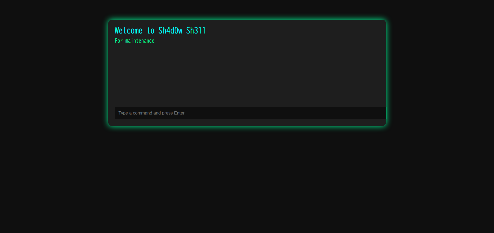
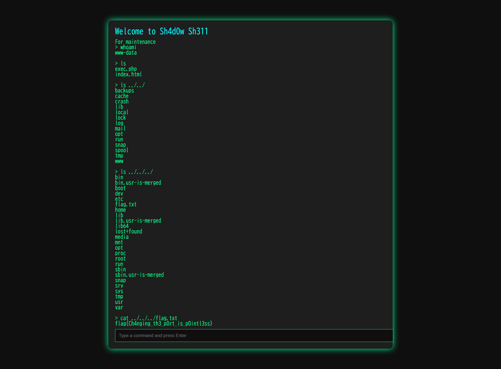

## HiddenService (255pt / 50 solves) [★☆☆☆]
> 会社の同僚がインターネットから接続できる場所に検証用サーバを構築していました。
> いわく、SSHは認証があって面倒だから自分しか知らない別の方法でサーバを操作できるようにしているそうです。
> サーバ内にあるファイル `flag.txt` を見つけて、会社の同僚にこのサーバが安全でないことを教えてあげてください。
> 
> 
> 本問題のターゲットマシンを起動してください。起動が完了したら、VPN接続マシンまたはBrowser Kaliから `<ターゲットのIP>` のマシンを調査してください。
> 
> 
> ヒント
> - このサーバではどのようなサービス、OSが動いているでしょうか？それらのバージョンは？どうすれば調べられるでしょうか？
> - 特定のファイルを探すのに便利なコマンドはないでしょうか？

まずはターゲットマシンを立ち上げ、ターゲットIPに対し`nmap -sS -sV -O`する。結果は以下。
```
$ nmap -sS -sV -O <target IP>
Starting Nmap 7.80 ( https://nmap.org ) at 2025-09-16 02:05 JST
Nmap scan report for <target IP>
Host is up (0.015s latency).
Not shown: 998 closed ports
PORT      STATE SERVICE VERSION
22/tcp    open  ssh     OpenSSH 9.6p1 Ubuntu 3ubuntu13.12 (Ubuntu Linux; protocol 2.0)
31337/tcp open  http    Apache httpd 2.4.58 ((Ubuntu))
No exact OS matches for host (If you know what OS is running on it, see https://nmap.org/submit/ ).
TCP/IP fingerprint:
OS:SCAN(V=7.80%E=4%D=9/16%OT=22%CT=1%CU=34311%PV=Y%DS=3%DC=I%G=Y%TM=68C8477
OS:5%P=x86_64-pc-linux-gnu)SEQ(SP=107%GCD=1%ISR=10B%TI=Z%CI=Z%II=I%TS=A)SEQ
OS:(SP=107%GCD=1%ISR=10B%TI=Z%CI=Z%TS=A)OPS(O1=M578ST11NW7%O2=M578ST11NW7%O
OS:3=M578NNT11NW7%O4=M578ST11NW7%O5=M578ST11NW7%O6=M578ST11)WIN(W1=F4B3%W2=
OS:F4B3%W3=F4B3%W4=F4B3%W5=F4B3%W6=F4B3)ECN(R=Y%DF=Y%T=40%W=F507%O=M578NNSN
OS:W7%CC=Y%Q=)T1(R=Y%DF=Y%T=40%S=O%A=S+%F=AS%RD=0%Q=)T2(R=N)T3(R=N)T4(R=Y%D
OS:F=Y%T=40%W=0%S=A%A=Z%F=R%O=%RD=0%Q=)T5(R=Y%DF=Y%T=40%W=0%S=Z%A=S+%F=AR%O
OS:=%RD=0%Q=)T6(R=Y%DF=Y%T=40%W=0%S=A%A=Z%F=R%O=%RD=0%Q=)T7(R=Y%DF=Y%T=40%W
OS:=0%S=Z%A=S+%F=AR%O=%RD=0%Q=)U1(R=Y%DF=N%T=40%IPL=164%UN=0%RIPL=G%RID=G%R
OS:IPCK=G%RUCK=8ED2%RUD=G)IE(R=Y%DFI=N%T=40%CD=S)

Network Distance: 3 hops
Service Info: OS: Linux; CPE: cpe:/o:linux:linux_kernel

OS and Service detection performed. Please report any incorrect results at https://nmap.org/submit/ .
Nmap done: 1 IP address (1 host up) scanned in 19.84 seconds
```

ssh以外に、31337(eleet)番ポートに謎のhttpサービスがある。ここにアクセスしてみると、こんなページが現れた。

</img>

自由にコマンドを実行できるようになっている。最初は`flag.txt`をあれこれ探し回ったが、`../../../flag.txt`を読み込めばOK。

</img>

### `flag{Ch4nging_th3_p0rt_is_p0intl3ss}`