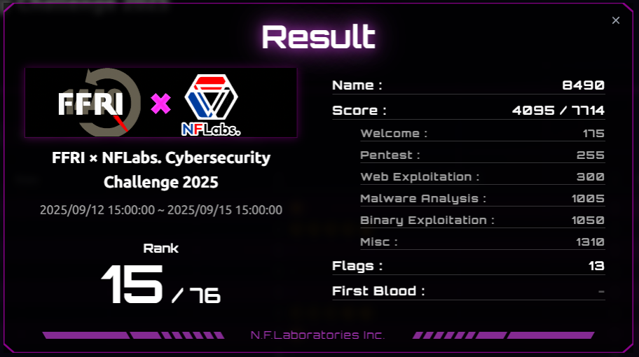

# FFRI × NFLabs. Cybersecurity Challenge 2025 Writeup

開催期間：2025-09-12_15:00:00_JST -> 2025-09-15_15:00:00_JST

解答できた問題一覧

問題タイトルが()で囲まれているものは解答できなかった問題。
- Welcome
  - Welcome [★☆☆☆]
- Pentest
  - HiddenService [★☆☆☆]
  - (Shell4Solr) [★★☆☆]
  - (Center) [★★★☆]
  - (Enumeration) [★★★★]
- Web Exploitation
  - Secure Web Company [★☆☆☆]
  - (Timecard) [★★☆☆]
  - (TimeFlies) [★★★☆]
  - (Cereal Blog) [★★★★]
- Malware Analysis
  - Downloader [★☆☆☆]
  - Acrobatics [★★☆☆]
  - CustomEncryptor [★★★☆]
  - (Hidden) [★★★★]
- Binary Exploitation
  - Abnormal [★☆☆☆]
  - Jump [★★☆☆]
  - Here are GOT and PLT [★★★☆]
  - (all rust and no safe) [★★★★]
- Misc
  - Bellaso [★★☆☆]
  - Hamburger [★★☆☆]
  - Lamp [★★☆☆]
  - Salted Hash Hunt [★★☆☆]

セキュリティ・キャンプ中に他の参加者の方から教えてもらってこのイベントの存在を知りました。最初は中～上級者向けの大会なのかな？と思っていましたが、蓋を開けてみると初心者に優しい問題も取り揃えられており、やっていて非常に楽しかったです。特にPentestジャンルの問題は、解答こそほとんどできなかったもののとても勉強になりました。

## 作問者writeupまとめ
後日公開されるようなので、その時に追記予定