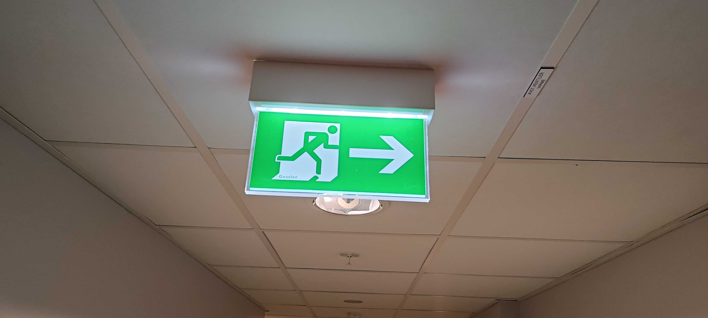

## EXIT (147pt / 189 solves) [Medium]
> Which country is this?  
Answer the country name using ISO 3166-1 alpha-3.  
Flag format: fwectf{FWE}
> 
> フラグの提出回数に制限があります。ご注意ください  
There is a limit on the number of flag submissions. Please be careful.
> 
> 添付ファイル: EXIT.jpg

「フラグの提出回数に制限があります。」と言われ緊張感が走る。それはそれとして問題を解く。

まずは非常口看板の"Gessler"が気になったが、調べてみるとこの非常口看板を製作している会社の名前のようで、さして有力な情報ではなさそうだった。ということでその右上にある"AVST.VENTILER VARME"に着目する。LLMに訊くとこれはノルウェー語であるという。（なお一度嘘を教えられた）そのままノルウェーで提出すると無事正解。

### `fwectf{NOR}`