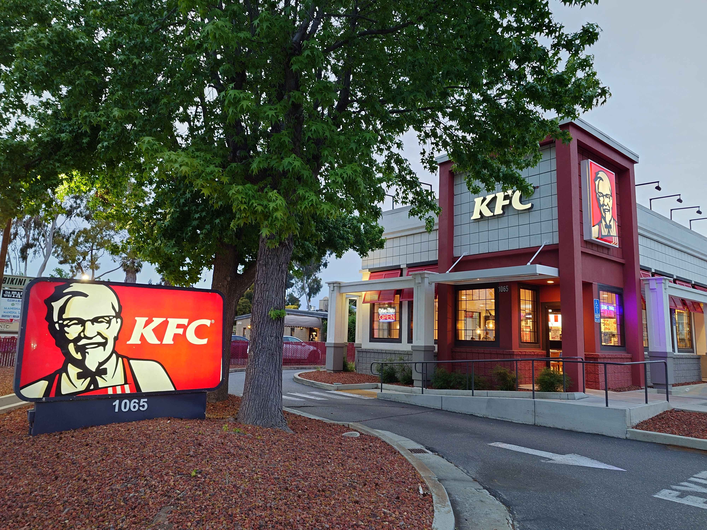
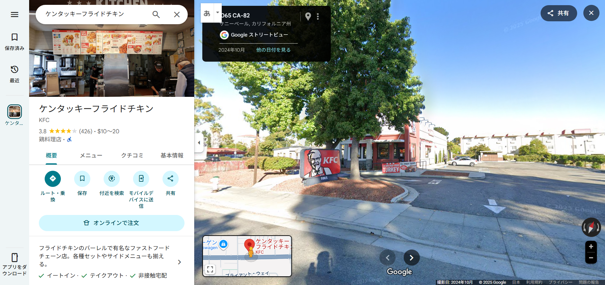

## GeoGuessr1 (100pt / 404 solves) [Beginner]
> この写真を撮っている人の座標を指定してください。 また、座標を直接指定すると誤差の許容範囲が表示されません。マウスクリックでご確認ください。
> 
> Please specify the coordinates of the person who took this photo. Note that if you enter the coordinates directly, the tolerance zone will not be shown. Please check it by clicking with the mouse.
> 
> 添付ファイル: GeoGuessr1.jpg

"KFC 1065"で調べると、[この店舗](https://locations.kfc.com/ca/sunnyvale/1065-east-el-camino-real)がヒットする。この店舗の付近をストリートビューで見てみるとビンゴだった。

写真を撮った位置も考慮すると`37.35238722261831, -122.00355276105962`辺りが答えになるだろうか。