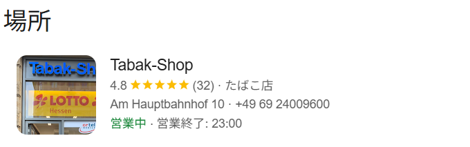

## GeoGuessr2 (100pt / 320 solves) [Beginner]
> この写真を撮っている人の座標を指定してください。 また、座標を直接指定すると誤差の許容範囲が表示されません。マウスクリックでご確認ください。
> 
> Please specify the coordinates of the person who took this photo. Note that if you enter the coordinates directly, the tolerance zone will not be shown. Please check it by clicking with the mouse.
> 
> 添付ファイル: GeoGuessr2.jpg

ひとまず看板の"kaisector"（？）で検索してみたものの、特に有力な情報は得られなかった。（私の探し方が悪い可能性は大いにある）  
ということでGoogle画像検索に掛ける。するとこんな[Threadsの投稿](https://www.threads.com/@donnieosullivan/post/DDb8jEjthA2)が見つかる。本文を翻訳しながら情報を探ると、問題の写真の位置はドイツのFFM(FrankFurt am Main？)、MAINZ、K-TOWN(Kaiserslautern)のどれかであるっぽい。ただ、絞り込むにはもう少し情報が欲しい。改めて画像を眺めてみると、右側に写る、植物に隠れているお店が気になる。

</img>

まずは"LOTTO Hessen"の方に注目した。このお店は宝くじ販売店らしい。Google Mapの方で先ほど挙げた地名を中心に調べてみるものの、店舗数が多いし店舗の写真が見つかりづらいしで、これらをしらみつぶしに探すのは現実的ではないと判断した。  
ならばということで"Tabak-Shop"の方にターゲットを移し、"Tabak-Shop Frankfurt"で検索するとドンピシャっぽいお店が見つかる！

建物の形状も問題の写真と完全に一致しており、ここで間違いなさそうである。結果的には`50.107654994697484, 8.66553241686746`周辺が答えとなった。