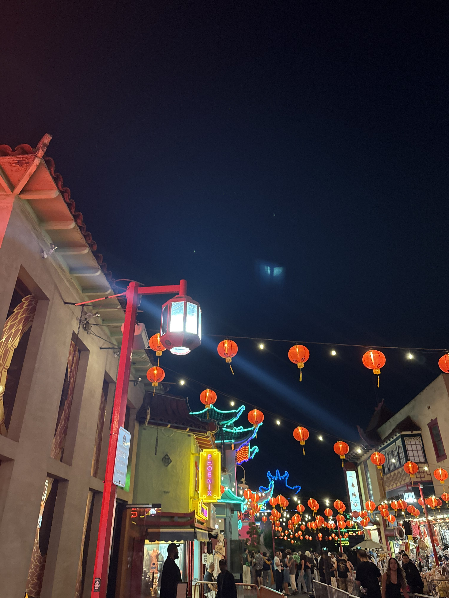
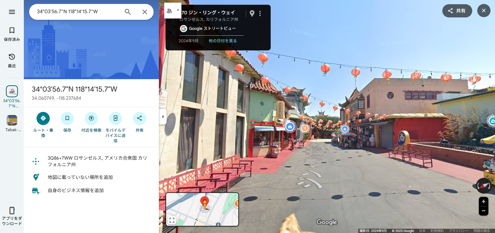

## GeoGuessr3 (100pt / 318 solves) [Medium]
> この写真を撮っている人の座標を指定してください。 また、座標を直接指定すると誤差の許容範囲が表示されません。マウスクリックでご確認ください。
> 
> Please specify the coordinates of the person who took this photo. Note that if you enter the coordinates directly, the tolerance zone will not be shown. Please check it by clicking with the mouse.
> 
> 添付ファイル: GeoGuessr3.jpg

右側に写っている「一本相命」（？）という看板が気になる。町の雰囲気はどことなくチャイナタウンっぽいので、「一本相命 china town」で検索してみると、問題の写真はロサンゼルスにあるチャイナタウンを写したものであることが分かった。細かい位置はGoogleマップのストリートビューで動き回って探した結果、`34.065749154852945, -118.23768386977146`周辺が答えとなった。

