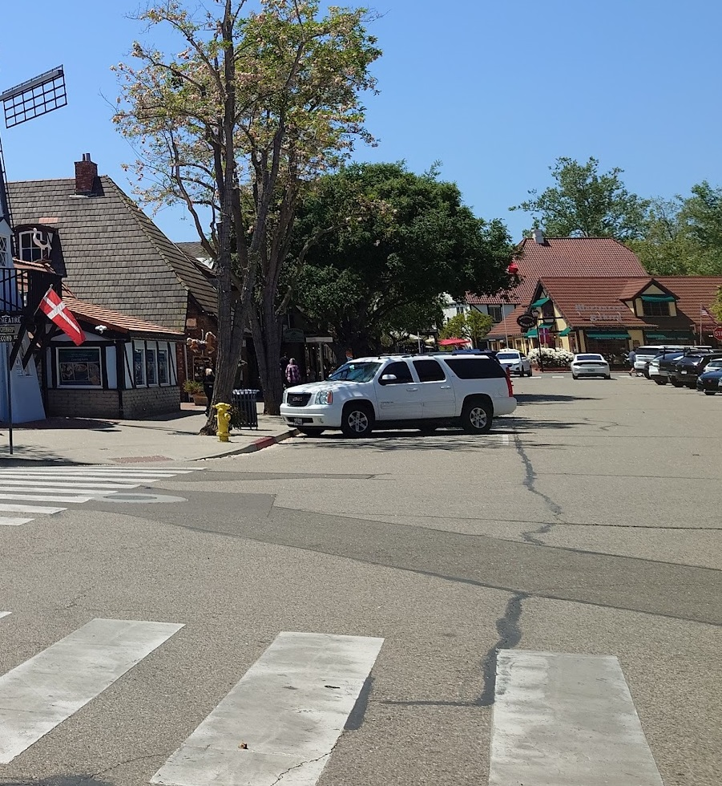
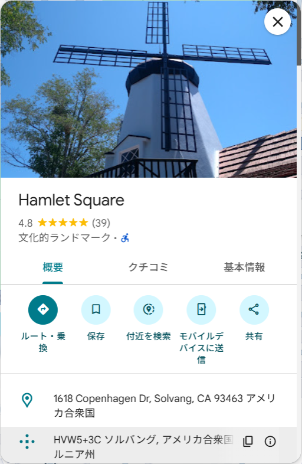
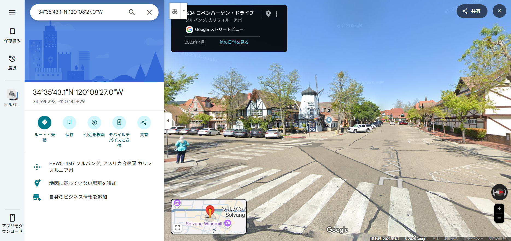

## GeoGuessr4 (133pt / 217 solves) [Hard]
> この写真を撮っている人の座標を指定してください。 また、座標を直接指定すると誤差の許容範囲が表示されません。マウスクリックでご確認ください。
> 
> Please specify the coordinates of the person who took this photo. Note that if you enter the coordinates directly, the tolerance zone will not be shown. Please check it by clicking with the mouse.
> 
> 添付ファイル: GeoGuessr4.jpg

まず黄色の消火栓に着目した。問題の写真に写っている国は明らかに日本ではないため、「消火栓 黄色 海外」で検索すると、アメリカの消火栓は基本的に黄色であることが分かった。そして明らかに怪しいデンマークの国旗。「アメリカ デンマーク」で検索すると、Solvangというデンマーク街がアメリカに存在しているという。  
場所を更に絞り込むために、左端に写る風車にも注目した。しかし、"Solvang windmill"の画像検索で主に出てくる風車は形状が違う。そこでGoogleマップでSolvang周辺を映し、"windmill"単体で検索してみると、Hamlet Squareというランドマークにある風車の形状が一致した。

</src>

この周辺をストリートビューで探索してみると、しっかり問題の写真と一致する景色を得られた。なぜか何度かIncorrectを返されたが、`34.59529313403824, -120.14082912136271`周辺が答えになったかと思う。

ストリートビューを見ると、デンマーク国旗は別の旗に差し替えられている。この状態のものを問題として出されるともう少し難しくなっていたかもしれない？