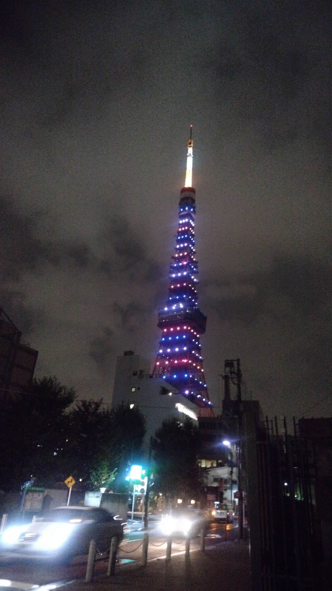

## YAKUMYAKU TOWER (260pt / 76 solves) [Medium]
> ミャクミャクみたいなかわいいタワーがあるね！この写真を撮影したのはいつだろう？ 撮影日を以下の形式で答えてね（誤差±1日許容） Flag形式：fwectf{YYYMMDD} 例：2025年8月30日の場合 fwectf{20250830}
> 
> There’s a tower lit up like Myakumyaku! When was this photo taken? Give the shooting date in the format below (± 1 day tolerance). Flag format: fwectf{YYYYMMDD} (Example: August 30 2025 → fwectf{20250830})
> 
> フラグの提出回数に制限があります。ご注意ください  
There is a limit on the number of flag submissions. Please be careful.
> 
> 添付ファイル: MYAKUMYAKU_TOWER.jpg

答えを見つけるのにそこそこ時間が掛かった問題である。まず過去の東京タワーのライトアップをまとめているサイトが無いかと探すと、[公式がカレンダーでまとめているサイト](https://www.tokyotower.co.jp/lightup/)があったので、ここを起点に探すことにした。とはいえ、一つずつ見ていくのは明らかに現実的ではないので、もう少し絞り込むことにした。  
写真上では紫基調の配色に見えたので、「東京タワー ライトアップ 紫」で画像検索してひたすら漁っていると、[それっぽい写真](https://acafe.msc.sony.jp/photo/detail/item/000027563022Hs)が見つかる。問題の写真と色合いはやや違うが、3色のパターンで光っていることや、メインデッキ部分のライトアップが控えめであることも一致する。  
撮影日は2018/09/14。先ほど挙げた公式のサイトから辿ると、同日とその次の日に当該ライトアップが行われていることが確認できた。よってフラグは以下の2つのうち、どちらかを提出すれば正解になる。解いていたときは恐る恐る1つ目のフラグを提出したが、無事Correctとなってホッとした。

### `fwectf{20180914}`
### `fwectf{20180915}`