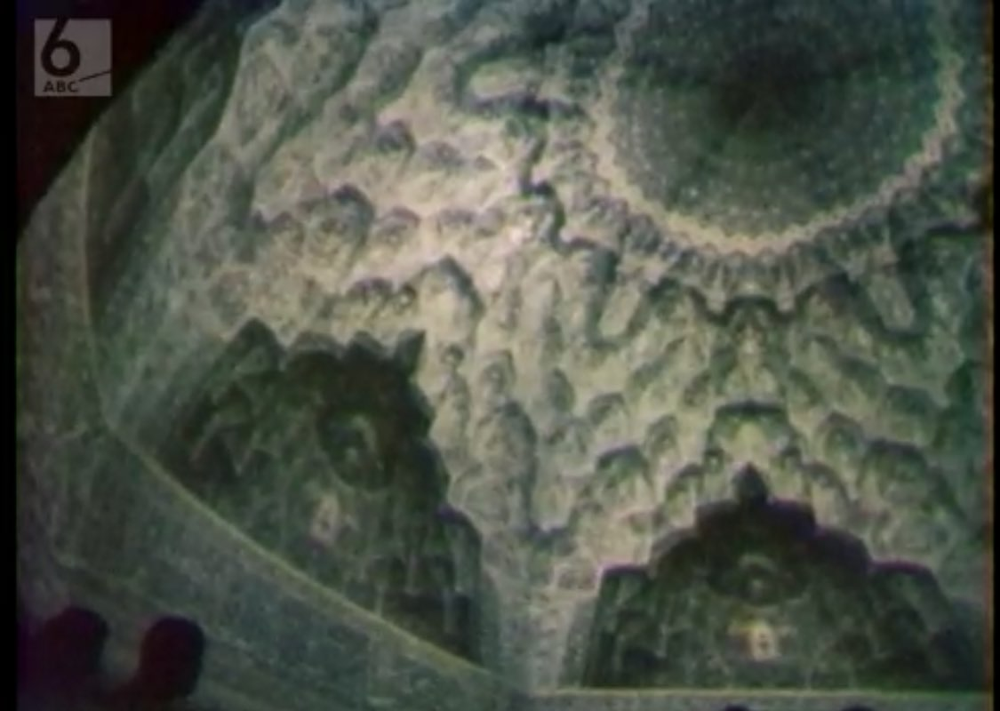
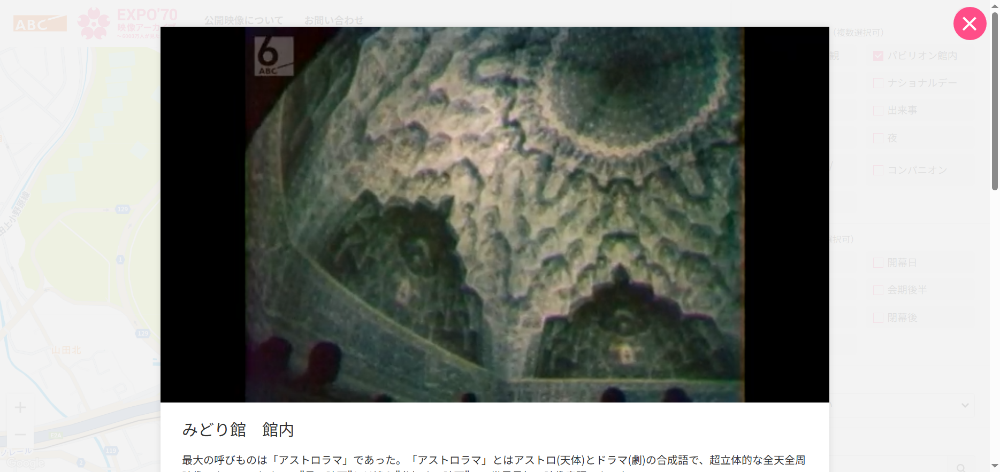

## Osaka Expo Pavilion Quiz! (256pt / 78 solves) [Easy]
> 大阪万博…だけど様子がちょっと変？ この映像が放送された館を答えよ  
Flag形式：fwectf{館名(日本語可)}
> 
> Osaka Expo... but something seems a little strange? Name the building where this footage was broadcast.  
Flag format: fwectf{Pavilion Name(Japanese OK)}
> 
> Note: If the flag contains spaces, they are optional.
> 
> 添付ファイル: IMG_3591.jpg

映像のアス比が16:9でない（おそらく4:3）ことからそもそも昔の映像であることが推測でき、大阪万博は大阪万博でも1970年の方の万博ではないか？と考えられた。更に画像左上のABCテレビ（朝日放送）のロゴから、1970年当時の映像アーカイブをABCテレビが公開しているところは無いかと探す。すると[見つかる](https://www.asahi.co.jp/expo70_archive)。  
「パビリオン館内」で絞り込みつつ探すと、「みどり館　館内」の動画内にて問題の画像とピッタリ一致するシーンが見つかる。答えは「みどり館」だった。

### `fwectf{みどり館}`