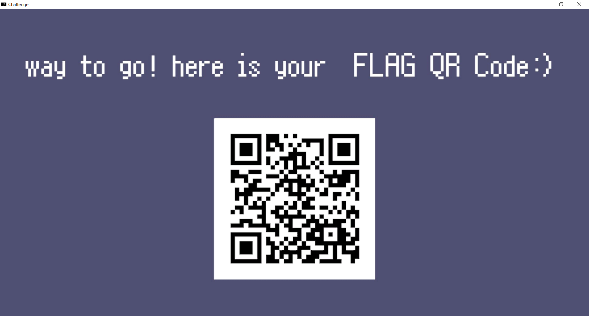

## Mystery Zone (227pt / 97 solves) [Medium]
> よぉ～みんな！　HelloWorld だぜ!!!  
flag を探してたら変な所に迷い込んじまったみてぇだ……。  
俺を操作して flag を見つけてくれ～!!  
お前たち最高だぜ！
>
> Whoa, duuuudes! HelloWorld, righteous!  
I was cruisin' the EXE lookin' for the flag when I totally got lost in this gnarly place, man . . . .  
Gimme a ping and help me find that flag, little dudes! Cowabunga!
> 
> 添付ファイル: Mystery_Zone.zip

zipを解凍するとUnity製のゲームが出てくる。実行すると、次のような画面が現れ、なんともレトロなBGMまで流れ始める。


WASDでシェルのバッシュ君を移動させることができる。が、遠くに行きすぎるとブルースクリーンが出現し、ゲームが終了してしまう。


(QRコードは読み込むと[こちら](https://www.youtube.com/@full-weak-engineer)に遷移する。問題には特に関係は無い)

恐らく闇雲に操作してもフラグは取れないだろうと踏み、Unityのゲームを解析する方法は無いかと探す。（更にメタ的な言い方をするとこれはReversingの問題なので、Reverseせずにフラグが取れるわけがないだろう、という考えもあった）

するとこんな[サイト](https://ethical-cheats.com/01_dnSpy%E3%81%A7%E3%82%BD%E3%83%BC%E3%82%B9%E3%82%B3%E3%83%BC%E3%83%89%E3%83%AC%E3%83%99%E3%83%AB%E3%81%A7%E3%82%B2%E3%83%BC%E3%83%A0%E6%94%B9%E7%AB%84/01_dnSpy%E3%81%A7%E3%82%BD%E3%83%BC%E3%82%B9%E3%82%B3%E3%83%BC%E3%83%89%E3%83%AC%E3%83%99%E3%83%AB%E3%81%A7%E3%82%B2%E3%83%BC%E3%83%A0%E6%94%B9%E7%AB%84.html)が見つかる。Unity製ゲームのソースコードは.NETアセンブリなので、dnSpyを使って中身を覗き、書き換えることもできるという。早速見てみると、`Update`関数が怪しい。そのソースコードを以下に示す。
```cs
// Shellmove
// Token: 0x06000004 RID: 4 RVA: 0x0000219C File Offset: 0x0000039C
private void Update()
{
	Vector3 position = base.gameObject.transform.position;
	if (Input.GetKey(KeyCode.Delete))
	{
		SceneManager.LoadScene("Main");
	}
	if (this.Len(position) >= 50.0)
	{
		this.TransError();
	}
	if (position == new Vector3(65535f, 65535f))
	{
		this.TransFlag();
	}
	if (!this.ismoving && this.canmove)
	{
		Vector3 zero = Vector3.zero;
		if (Input.GetKeyDown(KeyCode.W))
		{
			zero = new Vector3(0f, this.grid);
			this.walksound.Play();
		}
		if (Input.GetKeyDown(KeyCode.S))
		{
			zero = new Vector3(0f, -this.grid);
			this.walksound.Play();
		}
		if (Input.GetKeyDown(KeyCode.D))
		{
			zero = new Vector3(this.grid, 0f);
			this.walksound.Play();
		}
		if (Input.GetKeyDown(KeyCode.A))
		{
			zero = new Vector3(-this.grid, 0f);
			this.walksound.Play();
		}
		if (zero != Vector3.zero)
		{
			base.StartCoroutine(this.MoveSmooth(zero));
		}
	}
}
```

どうやらシェルのバッシュ君の座標である`position`が`(65535f, 65535f)`にあると`this.TransFlag()`が実行され、フラグのあるシーンに移動するらしい。この`position == new Vector3(65535f, 65535f)`の部分を例えば`position == position`とかにして、無条件で実行されるようにする。  
書き換え後、再びゲームを起動すると次のような画面に即座に移動し、QRコードを読み込めばフラグが得られる。



### `fwectf{K494ku_no_Ch1k4r4_t7e_5u63h!}`

問題文を見た瞬間に「あ！[シェルのバッシュ](https://www.youtube.com/watch?v=4YjiHpYWxh8)だ！」ってなった。セキュリティ・キャンプではありがとうございました。