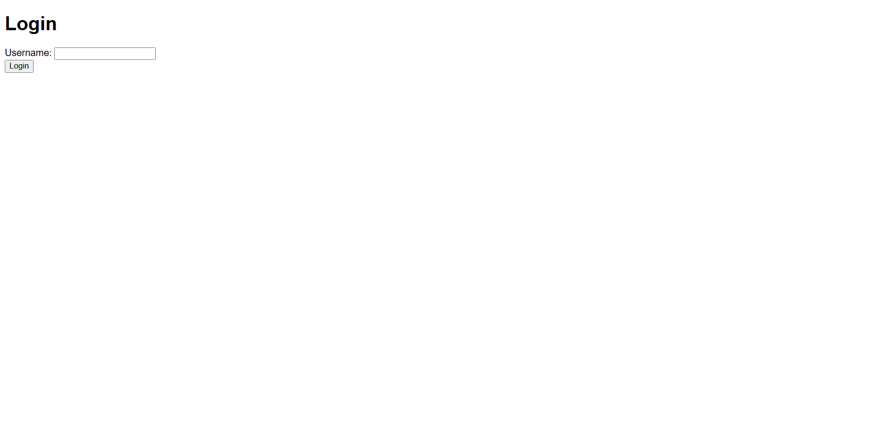
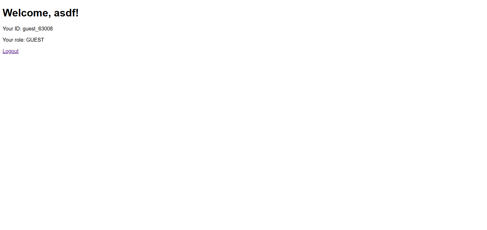
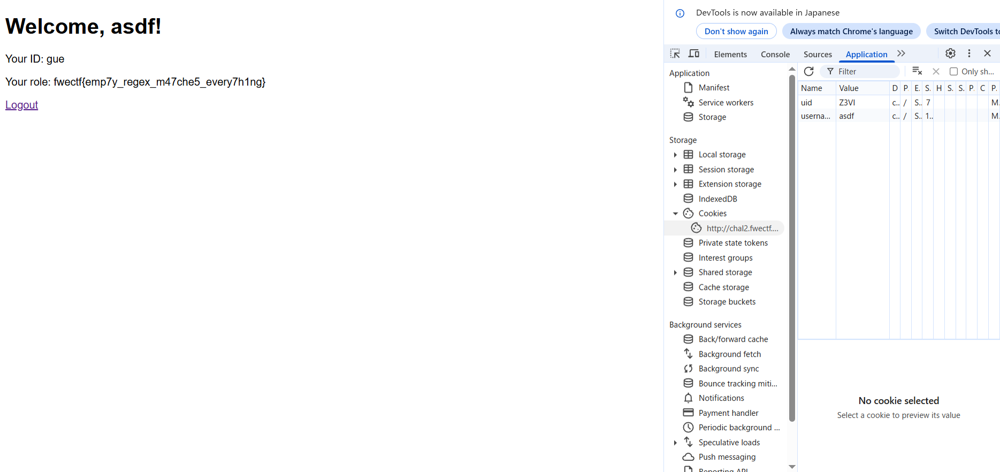

## regex-auth (100pt / 450 solves) [Beginner]
> 正規表現で認可制御をしてみました！
> 
> I tried implementing authorization control with regular expressions!
> 
> [問題鯖のURL]
> 
> 添付ファイル: regex-auth.zip

URLにアクセスすると、Usernameを入力するだけという、なんとも簡素なログイン画面が現れる。



適当に入力してログインしてみると、こんな感じになる。



ソースコードが与えられており、内容を以下に示す。
```python
from flask import Flask, request, redirect, make_response, render_template_string
import base64, os, re, random

app = Flask(__name__)
FLAG = os.getenv("FLAG", "fwectf{dummy}")

USERS = [
    "admin",
    "user",
    "asusn"
]

login_page = """
<!doctype html>
<title>Login</title>
<h1>Login</h1>
<form method="post">
  Username: <input type="text" name="username"><br>
  <input type="submit" value="Login">
</form>
"""

dashboard_page = """
<!doctype html>
<title>Dashboard</title>
<h1>Welcome, {{user}}!</h1>
<p>Your ID: {{uid}}</p>
<p>Your role: {{role}}</p>
<a href="/logout">Logout</a>
"""

@app.route("/", methods=["GET", "POST"])
def login():
    if request.method == "POST":
        username = request.form.get("username")

        if username in USERS:
            user_id = f"user_{random.randint(10000, 99999)}"
        else:
            user_id = f"guest_{random.randint(10000, 99999)}"

        uid = base64.b64encode(user_id.encode()).decode()

        resp = make_response(redirect("/dashboard"))
        resp.set_cookie("username", username)
        resp.set_cookie("uid", uid)
        return resp

    return render_template_string(login_page)

@app.route("/dashboard")
def dashboard():
    username = request.cookies.get("username")
    uid = request.cookies.get("uid")

    if not username or not uid:
        return redirect("/")

    try:
        user_id = base64.b64decode(uid).decode()
    except Exception:
        return redirect("/")

    if re.match(r"user.*", user_id, re.IGNORECASE):
        role = "USER"
    elif re.match(r"guest.*", user_id, re.IGNORECASE):
        role = "GUEST"
    elif re.match(r"", user_id, re.IGNORECASE): 
        role = f"{FLAG}"
    else:
        role = "OTHER"

    return render_template_string(dashboard_page, user=username, uid=user_id, role=role)

@app.route("/logout")
def logout():
    resp = make_response(redirect("/"))
    resp.delete_cookie("username")
    resp.delete_cookie("uid")
    return resp


if __name__ == "__main__":
    app.run(debug=False, host="0.0.0.0", port=3000)

```

注目したいのは`dashboard()`で、`user_id`が`user.`もしくは`guest.`から始まる文字列でなければフラグが得られるという。この`user_id`はクッキーの`uid`というbase64の値をデコードしたもの。つまり、`uid`を適当に書き替えてやれば、フラグが得られそうである。まあ書き換えるというよりかは、用意されている`uid`を削るだけでOK。  
そんなこんなで`uid`を弄ると、フラグが得られた。



### `fwectf{emp7y_regex_m47che5_every7h1ng}`