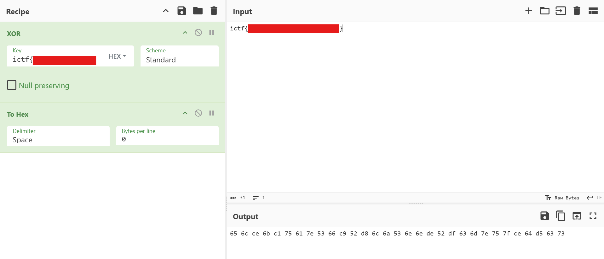

## redacted (100pt / 363 solves)
> wait, i thought XORing something with itself gives all 0s???
> 
> 添付ファイル: redacted.png

与えられている画像ファイル(redacted.png)を以下に示す。CTFerにはおなじみのCyberchefの画面で、フラグの中身が隠されている。

</img>

問題文が言っているように、同じ値同士でXORしているのに0になっていない。結論から言ってしまうと、これはInput側のフラグはUTF-8として解釈されているのにもかかわらず、鍵の種類を"HEX"にしているのが原因である。さらに`ictf{REDACTED}`は`0`～`f`/`F`以外の文字を含んでおり、16進数に変換する上において変な挙動を引き起こしている可能性がある。  
CyberChefはオープンソースであり、GitHubにてソースコードを見ることができる。入力した16進数文字列を数字に変換する処理は[ここ](https://github.com/gchq/CyberChef/blob/master/src/core/lib/Hex.mjs)の`fromHex()`である。注目すべきは以下の部分。
```javascript
const delimRegex = delim === "Auto" ? /[^a-f\d]|0x/gi : Utils.regexRep(delim);
data = data.split(delimRegex);
```
正規表現`/[^a-f\d]|0x/gi`は次の意味を持つ。
- `a`～`f`と数字以外、すなわち16進数以外の文字にマッチ
- あるいは`0x`にマッチ
- フラグ`g`, `i`により、全ての文字にマッチし、大文字小文字は区別しない

そしてこの正規表現にマッチした文字は`data = data.split(delimRegex);`によって区切り文字として扱われる。つまり、`ictf{REDACTED}`を16進数に変換すると  
`(i) c (t) f ({REDACTED})`  
↓  
`0c0f`...  
と見なされるわけである。  
更に言えることとして、この性質により分かっていない区切り文字の特定は難しい。よってゴールは鍵を導出するのではなく、XORされる前の元のフラグを何とかして復元することとなる。CyberChefのXOR Brute Forceでひとまず`ictf`に対応する鍵を2文字ずつ[^1]求めていくと、`0c0fba0d`までが求められた。

↓作業の様子  
</img>

この鍵で一旦XORしてみると、以下のように部分的に復号されているらしき部分が見られた。（具体的には`_is_`や`bad_`）`bad_`は鍵の`ba0d`と対応する部分だろうか。

</img>

もう少しヒントが欲しい。`ictf{`までは分かっているので、これに対応する鍵`0c0fba0dba`で復号を試みたが、先程のようにヒントになる部分すらなかった。さてどうしたものか。良さそうな方法が思い浮かばなかったので、もう1バイト鍵を増やせば何か得られないか？と思い立ち、ついにあまりやりたくなかった総当たりを行う。すると、鍵を`0c0fba0dba0d`とした時、光明が開ける。

</img>

`ictf{x`から、もしかして`ictf{xor_is_bad`...`encryption}`みたいな感じなのではないか？と予想。
ひとまず`ictf{xor`に対応する鍵を求めると`0c0fba0dba0d0e0c`だと分かったので、これでXORしてみる。すると全文復号できていた。

</img>

### `ictf{xor_is_bad_bad_encryption}`

[^1]: ブラウザのパフォーマンス制限という理由により、一度に求められる鍵は2文字までになっている
