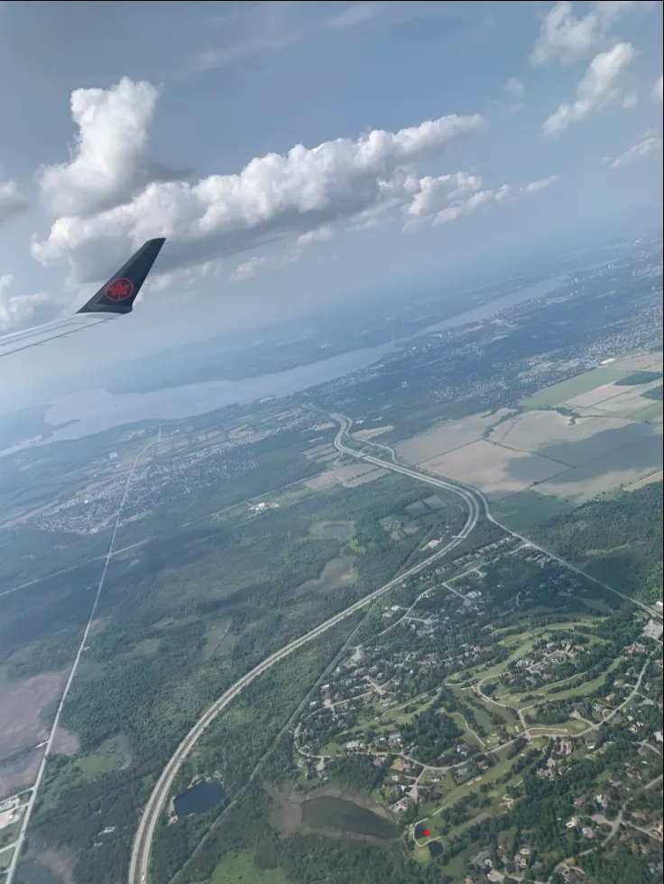
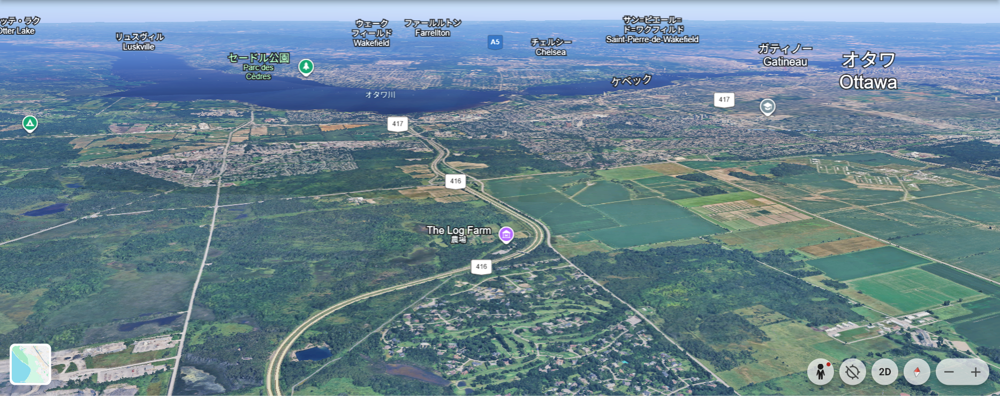

## zoom (100pt / 278 solves)
> Where in the world is the red dot?
>
> Format: ictf{lat,long} rounded to three decimal places. example: ictf{12.345,-67.890}
>
> 添付ファイル: beavertail.png

</img>

はてさて一体全体どこだろう。写っている飛行機はロゴからエア・カナダが所有しているものだということは分かったが、調べてみたところ運航路線は非常に多く、ここから絞り込むのは無理がありそうだと感じた。Google画像検索でもめぼしい結果は無し。ということでChatGPTに訊いてみることにした。  
どうやら場所としてはカナダで合っているようで、下部に見える土地はゴルフ場らしい。そこからカナダにあるゴルフ場を列挙させてGoogle Earthでひたすらに探したが、この空撮写真に一致しそうなところは見つからなかった。  
日本語で駄目なら英語だ、と方針を転換させ、あえて英語でChatGPTに訊いてみると、オンタリオ川近くを通る416番ハイウェイではないかと言われる。その周辺を改めて根気強く探してみると......あった。

</img>

問題の赤点の位置は緯度`45.283°`, 経度`-75.795°`でOKだった。

### `ictf{45.283,-75.795}`

自分の探し方が悪かった（ゴルフ場から絞り込むのは今考えてもかなり非効率）のもあり、かなり余計な時間を使ってしまった。海外の場所を当てる問題は、最初から英語でLLMに訊くようにした方がグッと答えに近付けるかもしれない。