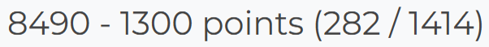

# ImaginaryCTF 2025 Writeup

開催期間：2025-09-06_04:00:00_JST -> 2025-09-08_04:00:00_JST

[解答できた問題一覧](images/problems.png)

> ImaginaryCTF 2025 is a cybersecurity CTF competition run by ImaginaryCTF with a variety of challenges for all skill levels.

という触れ込みのCTF大会であり、確かに初心者レベルでも解ける問題は少しばかりあったものの、問題全体の平均レベルは割と高めに感じました。ただこれは私の熟練度不足が大いに影響していると思われ、私が解けていない（恐らく）簡単寄りの問題のスコアがあっという間に100点に落ちていくのはちょっと怖かったです。海外プレイヤーの層の厚さをいたく実感しました。  
ご存知の方もいるかと思いますが、このImaginaryCTF、普段は毎日1つずつチャレンジが出題されるというちょっと変わった形式をとっています。今大会の準備のためかここ最近は出題が止まっていましたが、どうやら10月には平常運行に戻るようなので、戻り次第そちらの方にも参加してみようかなと思います。

## 作問者writeupまとめ
https://github.com/ImaginaryCTF/ImaginaryCTF-2025-Challenges