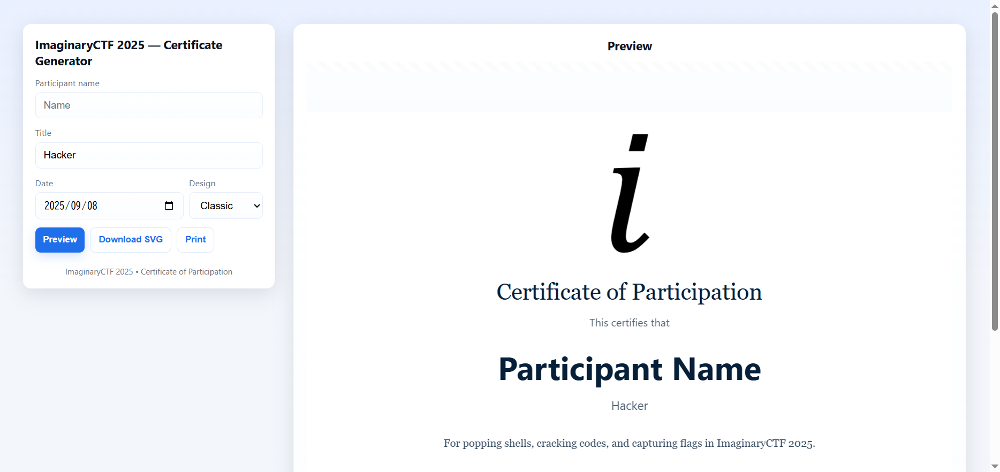
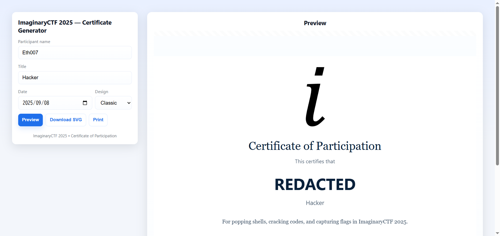

## certificate (100pt / 390 solves)
> As a thank you for playing our CTF, we're giving out participation certificates! Each one comes with a custom flag, but I bet you can't get the flag belonging to Eth007!
> 
> https://eth007.me/cert/

ソースコード等の配布は無し。

アクセスすると次のようなページが表示される。

</img>

名前通りの参加証明書ジェネレータである。カスタムフラグはどこにあるのかというと、ダウンロードされたSVGの中に入っている。以下に示すのは、`Name`を`8490`にしたときのカスタムフラグである。

```
<svg xmlns="http://www.w3.org/2000/svg" width="1122" height="794" viewBox="0 0 1122 794">
  <desc>ictf{49b26186}</desc>
  <rect width="100%" height="100%" fill="#fbfdff"/>

...
```

提出すべきフラグは`Name`を`Eth007`にしたときのカスタムフラグである。しかし、そのまま名前を入力しても`REDACTED`となり、欲しいフラグを手に入れることはできない。

</img>

このサイトはソースコードを見ることができるので、読んでみる。すると`customHash()`, `makeFlag()`という気になる関数があった。

```javascript
function customHash(str){
  let h = 1337;
  for (let i=0;i<str.length;i++){
    h = (h * 31 + str.charCodeAt(i)) ^ (h >>> 7);
    h = h >>> 0; // force unsigned
  }
  return h.toString(16);
}

function makeFlag(name){
  const clean = name.trim() || "anon";
  const h = customHash(clean);
  return `ictf{${h}}`;
}
```

どうやらフラグの中身は入力した`Name`を独自実装のハッシュ関数に掛けたものであるらしい。つまり、わざわざ参加証明書を作成しなくとも`customHash('Eth007')`の結果さえ得られればOK。  
ということで適当なplaygroundにて結果を再現する。欲しいフラグの中身が得られた。

</img>

### `ictf{7b4b3965}`