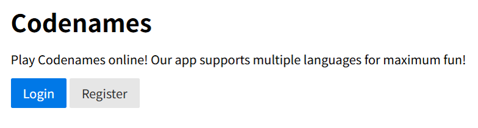
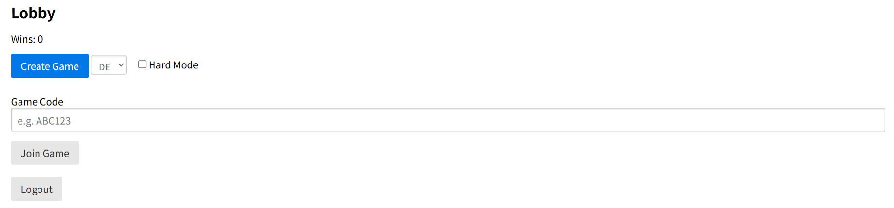
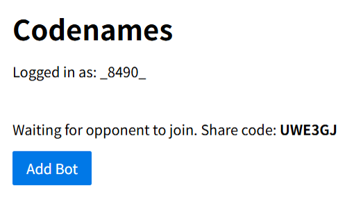
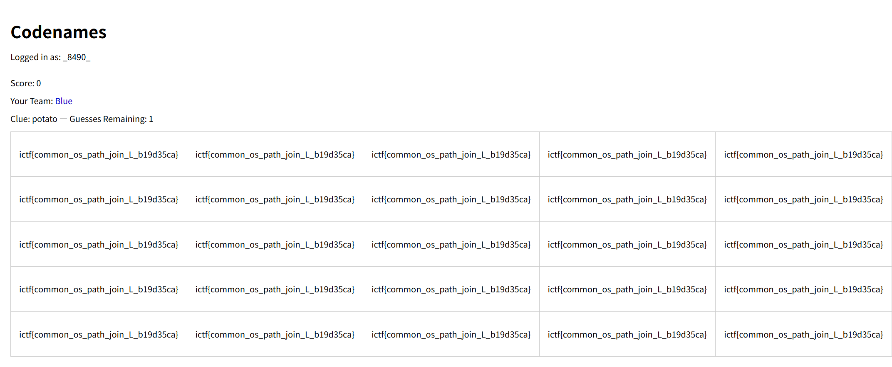

## codenames-1 (100pt / 317 solves)
> I hear that multilingual codenames is all the rage these days. Flag is in /flag.txt.
> 
> [問題鯖のURL] (bot does not work on this instance, look at codenames-2 for working bot)
> 
> 
> 添付ファイル: codenames.zip

URLにアクセスすると、次のようなサイトが現れる。

</img>

サインアップするとロビーに移動する。

</img>

ただただページを眺めているだけでは方針も浮かんでこないので、与えられているソースコード(`app.py`)を見る。以下に気になった箇所だけを抜き出して載せる。

```python
...

@app.route('/create_game', methods=['POST'])
def create_game():
    if 'username' not in session:
        return redirect(url_for('index'))
    # generate unique code
    while True:
        code = ''.join(random.choices(string.ascii_uppercase + string.digits, k=6))
        if code not in games:
            break
    # prepare game with selected language word list
    # determine language (default to first available)
    language = request.form.get('language', None)
    if not language or '.' in language:
        language = LANGUAGES[0] if LANGUAGES else None
    # load words for this language
    word_list = []
    if language:
        wl_path = os.path.join(WORDS_DIR, f"{language}.txt")
        try:
            with open(wl_path) as wf:
                word_list = [line.strip() for line in wf if line.strip()]
        except IOError as e:
            print(e)
            word_list = []

...
```

いかにもフラグを取るのに使えそうなのは`wl_path = os.path.join(WORDS_DIR, f"{language}.txt")`の部分で、通常`language`はCreate Gameボタン横のコンボボックスで選択するのだが、正規の手段を経ることなく細工した値をPOSTすればディレクトリトラバーサルにより`/flag.txt`を開かせることが出来そうである。ただし直前で`if not language or '.' in language:`とあるように`.`は使えなくされているため、`../../../../flag`みたいな値を送っても効かない。そこで`os.path.join()`自体に脆弱性等がないか調べてみると、「絶対パスを含む引数よりも前の引数はすべて無視される」という仕様があるらしい。これを悪用する。つまり`WORDS_DIR`がどのような値であろうと、`os.path.join(WORDS_DIR, f'/flag.txt')`とすれば`/flag.txt`を指すようになるのである。  
何をすべきかは決まったのでひとまずPOSTしてみる。「Create Game」ボタンを押すことで送信される正規のPOSTリクエストをDevtoolのNetworkタブからCopy as cURLとかでパクってきて、`--data-raw 'language=[言語名]'`のところを`--data-raw 'language=/flag'`にして送信。すると次のレスポンスが返ってくる。

```html
<!doctype html>
<html lang=en>
<title>Redirecting...</title>
<h1>Redirecting...</h1>
<p>You should be redirected automatically to the target URL: <a href="/game/UWE3GJ">/game/UWE3GJ</a>. If not, click the link.
```

target URLにアクセスするとこんな画面が表示される。

</img>

Add Botで対戦相手をBotにし、ゲームを開始するとフラグが一面に表示されている。

</img>

単純なドラッグでのコピペは出来ないようになっているが、`console.log(board)`等で中身を持ってこられる。

### `ictf{common_os_path_join_L_b19d35ca}`