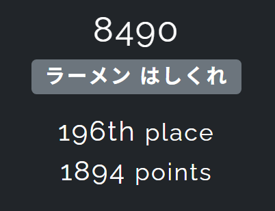

# SECCON Beginners CTF 2025 Writeup

開催期間：2025-07-26_14:00:00_JST -> 2025-07-27_14:00:00_JST

[解答できた問題一覧](images/problems.png)

イベント型のCTF参加は2回目で、個人参加でした。もう少しやれたかなー、とやや悔いもありますが、現在自分が持っている力を概ね出し切れたという感触です。  
しかしながらいかんせんwebとcryptoに弱すぎるので、この辺りをしっかり底上げしていきたいと感じました。  
こんな感じで反省点も多々あるものの、感想としては「CTF楽しい！！！」の一言に尽きますね。来年は一つ以上のジャンル全完を目標に精進していきます。  

個別のwriteupには載せませんが、あともう少しで解けそう（or解けた）だったかも、という問題を下に載せておきます。

## pivot4b++
read関数からのアドレスリークでバイナリのベースアドレスを求めることができ、更にpartial overwriteでvuln関数を繰り返し実行できるようになったが、そこからどのようにして変数messageのアドレスを特定すれば良いのかが分からなかった。PIEの厄介さを思い知らされた。

## 作問者writeupまとめ
- web
  - https://melonattacker.github.io/posts/51/
    - skipping, メモRAG
  - https://gist.github.com/kotokaze/dc39dbb7dbe4dec389358eefc4abcd10
    - log-viewer
  - https://gist.github.com/shiosa1t/f0e051aba5613efc504a5385072dc43e
    - memo4b
  - https://qiita.com/xryuseix/items/c27924ef5e9e9dfb827e
    - login4b
- crypto
  - https://melonattacker.github.io/posts/51/
    - seesaw
  - https://yu212.hatenablog.com/entry/2025/07/27/163347
    - 01-Translator, Elliptic4b, Golden Ticket (+mathmyth)
- misc
  - https://qiita.com/xryuseix/items/c27924ef5e9e9dfb827e
    - kingyo_sukui
  - https://melonattacker.github.io/posts/51/
    - url-checker, url-checker2
  - https://gist.github.com/kotokaze/dc39dbb7dbe4dec389358eefc4abcd10
    - Chember of Echos
- reversing
  - https://zenn.dev/juck28/articles/64c6bdca67376e
    - CrazyLazyProgram1, CrazyLazyProgram2, D-compile, MAFC
- pwnable
  - https://blog.kuonruri.org/seccon-beginners-ctf-2025-writeup
    - pivot4b, pivot4b++, TimeOfControl

