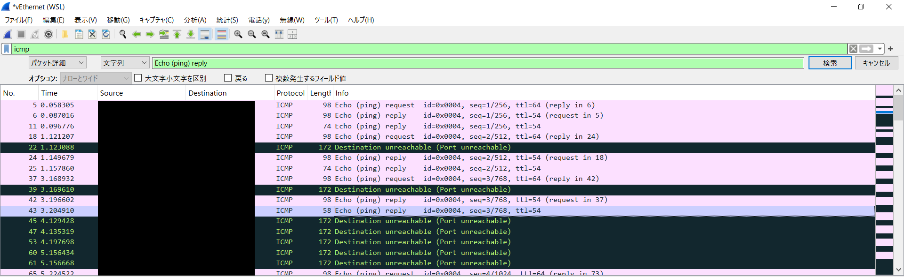

## Chamber of Echos (100pt / 235 solves) [medium]
> どうやら私たちのサーバが機密情報を送信してしまっているようです。 よーく耳を澄ませて正しい方法で話しかければ、奇妙な暗号通信を行っているのに気づくはずです。 幸い、我々は使用している暗号化方式と暗号鍵を入手しています。 収集・復号し、正しい順番に並べてフラグを取得してください。  
> ___  
> 暗号化方式: AES-128-ECB  
> 復号鍵 (HEX): 546869734973415365637265744b6579  
> [問題鯖のホスト名]

与えられているホスト名をそのままブラウザに入力してもアクセスできない。`nc`も効果なし。  
ということで、Pythonのソースコードが与えられているのでひとまずそれを見てみることにした。内容を以下に示す。
```python
#!/usr/bin/env python3.12
import random
from math import ceil
from os import getenv

from Crypto.Cipher import AES
from Crypto.Util.Padding import pad
from scapy.all import *

type PlainChunk = bytes
type EncryptedChunk = bytes
type FlagText = str

################################################################################
FLAG: FlagText = getenv("FLAG")
KEY: bytes = b"546869734973415365637265744b6579"  # 16進数のキー
BLOCK_SIZE: int = 16  # AES-128-ECB のブロックサイズは 16bytes
################################################################################

# インデックスとともに `%1d|<FLAG の分割されたもの>` の形式の 4byte ずつ分割
prefix: str = "{:1d}|"
max_len: int = BLOCK_SIZE - len(prefix.format(0))  # AES ブロックに収まるように調整
parts: list[PlainChunk] = [
  f"{prefix.format(i)}{FLAG[i * max_len:(i + 1) * max_len]}".encode()
  for i in range(ceil(len(FLAG) / max_len))
]

# AES-ECB + PKCS#7 パディング
cipher = AES.new(bytes.fromhex(KEY.decode("utf-8")), AES.MODE_ECB)
encrypted_blocks: list[EncryptedChunk] = [
  cipher.encrypt(pad(part, BLOCK_SIZE))
  for part in parts
]

def handle(pkt: Packet) -> None:
  if (ICMP in pkt) and (pkt[ICMP].type == 8):  # ICMP Echo Request
    print(f"[+] Received ping from {pkt[IP].src}")
    payload: EncryptedChunk = random.choice(encrypted_blocks)
    reply = (
      IP(dst=pkt[IP].src, src=pkt[IP].dst) /
      ICMP(type=0, id=pkt[ICMP].id, seq=pkt[ICMP].seq) /
      Raw(load=payload)
    )
    send(reply, verbose=False)
    print(f"[+] Sent encrypted chunk {len(payload)} bytes back to {pkt[IP].src}")


if __name__ == "__main__":
  from sys import argv
  iface = argv[1] if (1 < len(argv)) else "lo" # デフォルトはループバックインターフェース

  print(f"[*] ICMP Echo Response Server starting on {iface} ...")
  sniff(iface=iface, filter="icmp", prn=handle)

```
`ICMP Echo`とは平たく言えば`ping`のことのようだが、全体的にどういうことをしているスクリプトなのかいまいち自分だけでは噛み砕けなかったため、ChatGPTに要約を頼んだ。曰く、次のようなことを行うスクリプトらしい。
1. フラグを14バイトずつに分割し、それぞれのブロックの先頭に2バイトのprefixを加えたのち、適宜PKCS#7パディングを加えてAESのブロック長である16バイトに揃えてからECBモードで暗号化。
2. `ICMP Echo Request` = ping要求があれば、作成した暗号化ブロックのいずれかから一つ選び、`ICMP Echo Reply` = ping応答で返す。

つまり、フラグを得るためにはping応答を何らかの方法で取得し、既に持っている鍵を用いて復号すれば良い。（ECBモードなので復号は容易）  
その肝心のping応答を得る方法がピンと来なかったため、これもChatGPTに訊いてみたところ、Wiresharkを使うことを提案される。なるほどその手があったか、ということでターミナル上でpingしながら、Wiresharkで通信を30秒ほどキャプチャ。


得られたping応答パケット中のDataフィールドをCyberchefを用いてちまちまと復号していくと、次の画像のようにフラグが得られた。


```
0| ctf4b{th1s_1s_
1| c0v3rt_ch4nn3l
2| _4tt4ck}
```

### `ctf4b{th1s_1s_c0v3rt_ch4nn3l_4tt4ck}`
