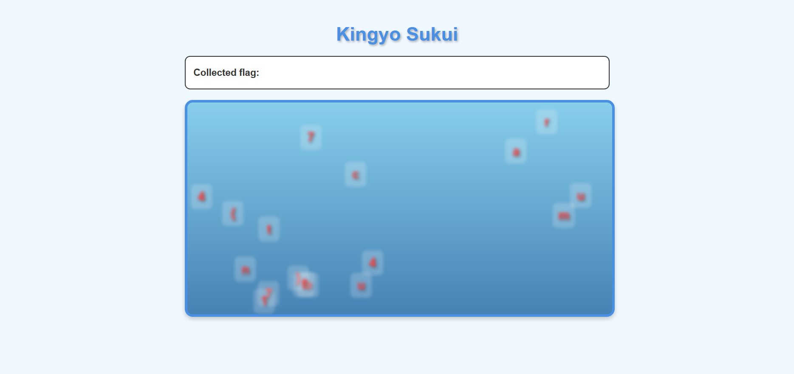
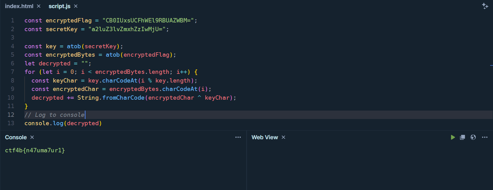
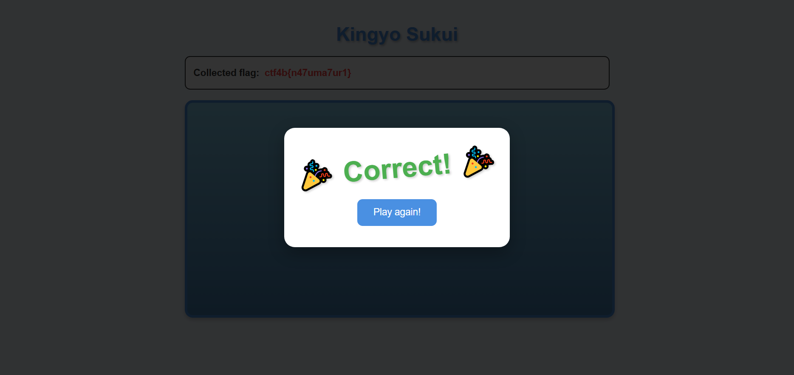

## kingyo_sukui (100pt / 644 solves) [beginner]
> scooping! [問題鯖のURL]

アクセスしてみると、次の画像のようなWebページが表示された。


金魚......もといフラグを正しい順番ですくうゲーム（？）なのだろうが、もちろんこんなものに付き合う必要はない。  
ということでWebページのjavascriptが与えられているのでそれを見ることにする。やや長いので、注目した箇所のみを以下に示す。
```javascript
class FlagGame {
  constructor() {
    this.encryptedFlag = "CB0IUxsUCFhWEl9RBUAZWBM=";
    this.secretKey = "a2luZ3lvZmxhZzIwMjU=";

    ...

    }

...

decryptFlag() {
    try {
      const key = atob(this.secretKey);
      const encryptedBytes = atob(this.encryptedFlag);
      let decrypted = "";
      for (let i = 0; i < encryptedBytes.length; i++) {
        const keyChar = key.charCodeAt(i % key.length);
        const encryptedChar = encryptedBytes.charCodeAt(i);
        decrypted += String.fromCharCode(encryptedChar ^ keyChar);
      }
      return decrypted;
    } catch (error) {
      return "decrypt error";
    }
  }

...
```
要は、decryptFlag関数と同じことをそっくりそのまま行えばフラグが得られる。
次の画像のように手頃なplayground（今回は[ここ](https://playcode.io/javascript)を使った）にまるっとコードを移植して、`decrypted`の内容を出力してやるとフラグが得られた。


### `ctf4b{n47uma7ur1}`

おまけ

