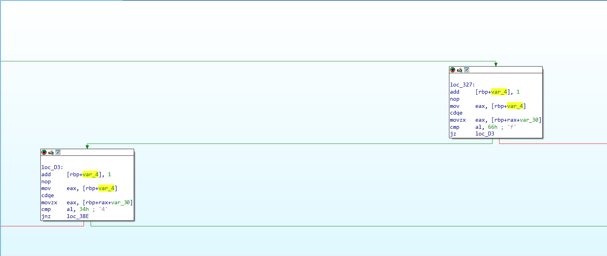

## CrazyLazyProgram2 (100pt / 468 solves)
> コーディングが面倒だったので機械語で作ってみました

~機械語で作る方が面倒そうなのですが~  
ということで今回はソースコードではなくオブジェクトファイル(.o)が与えられている。  
試しにobjdumpをしてみるとまあまあ長めのアセンブリが出力されるので、これをそのまま読みに行くのは現実的ではないと考えた。  
ひとまずIDA（もちろんFree）で見てみると、CrazyLazyProgram1と同様に、cmp命令で一文字ずつ比較を行っているのが分かる。

結局、グラフの上から条件分岐を辿り、手動で1文字ずつフラグを集めていった。非効率的なのは分かってはいたが、さほど時間が掛かる作業でもないので、効率的な方法があったとしても大きな差ではないだろうと考えた。（他の参加者のwriteupだとLLMにフラグを出させるやり方をかなり見かけた。なぜかその発想はこの問題に対しては浮かばなかった）

### `ctf4b{GOTO_G0T0_90t0_N0m0r3_90t0}`
