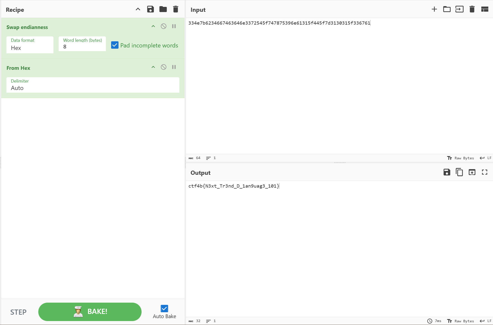

## D-compile (100pt / 335 solves) [easy]
> C言語の次はこれ!
> 
> This is the next trending programming language!
> 
> ※一部環境ではlibgphobos5が必要となります。 また必要に応じてecho -nをご利用ください。
> 
> Note:In some environments, libgphobos5 is required. Also, use the echo -n command as necessary.

バイナリのみが与えられているが、問題文にある通り、実行するためには私の環境では`libgphobos5`を導入する必要があった。（この導入だけでかなり時間をかけたのはナイショ）  
`libgphobos5`を導入した後に実行してみると、`input flag>`とだけ表示され、フラグの入力を求められる。もちろん知るはずもないので適当に入力してやると、`this is wrong`と返されて終了した。  
これでは埒が明かないのでやはり解析を行う。今回はGhidraを使用した。色々探し回ってみると、_Dmain関数内にて次に示す意味ありげな処理群を発見。
```c
undefined8 _Dmain(void)

{
  char cVar1;
  undefined8 *puVar2;
  undefined auVar3 [16];
  
  puVar2 = (undefined8 *)_d_arrayliteralTX(&_D11TypeInfo_Aa6__initZ,0x20);
  *puVar2 = 0x334e7b6234667463;
  puVar2[1] = 0x646e3372545f7478;
  puVar2[2] = 0x75396e61315f445f;
  puVar2[3] = 0x7d3130315f336761;
  _D3std5stdio__T7writelnTAyaZQnFNfQjZv(0xb,"input flag>");
  auVar3 = _D3std5stdio__T6readlnTAyaZQmFwZQj(10);
  cVar1 = _D4core8internal5array8equality__T8__equalsTaTaZQoFNaNbNiNeMxAaMxQeZb
                    (auVar3._0_8_,auVar3._8_8_,0x20,puVar2);
  if (cVar1 == '\0') {
    _D3std5stdio__T7writelnTAyaZQnFNfQjZv(0xd,"this is wrong");
  }
  else {
    _D3std5stdio__T7writelnTAyaZQnFNfQjZv(0x1e,"way to go! this is the flag :)");
  }
  return 0;
}
```

何やら関数名は奇怪なことになっているが、要は入力データを配列puVar2の内容と比較しているのだろうと考え、puVar2に格納されているhexをASCIIに変換すると、`3N{b4ftcdn3rT_txu9na1_D_}101_3ga`という明らかにフラグらしき文字列が得られた。  
ぐちゃぐちゃになっているのかと思いきや、よく見ると8文字ごとに文字が逆順に並んでいる。（`{b4ftc`が分かりやすい）すなわちリトルエンディアンである。
変換の為だけにコードを書くのも煩わしいので、Cyberchefでお料理してやった。


### `ctf4b{N3xt_Tr3nd_D_1an9uag3_101}`

......うすうす分かってはいたことなのだが、結果的に`libgphobos5`を導入する必要はなかった。
