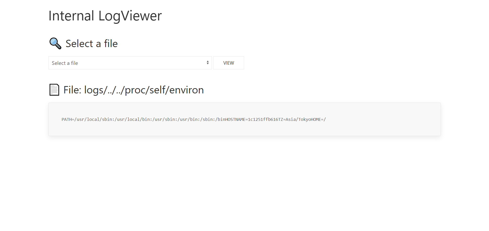
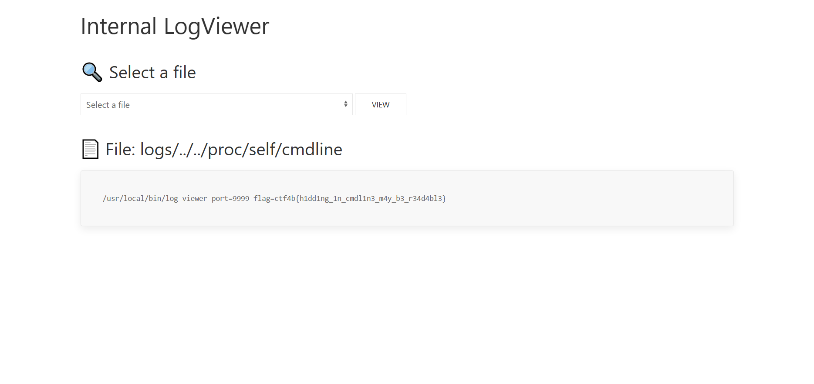

## log-viewer (100pt / 621 solves) [easy]
> ログをウェブブラウザで表示できるアプリケーションを作成しました。 これで定期的に集約してきているログを簡単に確認できます。 秘密の情報も安全にアプリに渡せているはずです...
>
> [問題鯖へのURL]

ソースコード等は与えられていない。

提示されているURLにアクセスすると、次のようなサイトが表示された。


ドロップダウンメニューから閲覧するログファイルを選ぶことができ、`access.log`と`debug.log`の2つを見ることができる。それぞれのログの内容を以下に示す。

<access.log>
```
192.168.65.1 - - [21/June/2025:10:41:56 +0900] "GET / HTTP/1.1" 200 526 "-" "Mozilla/5.0 (Macintosh; Intel Mac OS X 10.15; rv:138.0) Gecko/20100101 Firefox/138.0"
192.168.65.1 - - [21/June/2025:10:41:56 +0900] "GET /favicon.ico HTTP/1.1" 200 526 "http://localhost:8000/" "Mozilla/5.0 (Macintosh; Intel Mac OS X 10.15; rv:138.0) Gecko/20100101 Firefox/138.0"
192.168.65.1 - - [21/June/2025:10:41:58 +0900] "GET / HTTP/1.1" 200 526 "-" "Mozilla/5.0 (Android 13; Mobile; rv:109.0) Gecko/114.0 Firefox/114.0"
192.168.65.1 - - [21/June/2025:10:41:58 +0900] "GET /favicon.ico HTTP/1.1" 200 526 "http://localhost:8000/" "Mozilla/5.0 (Android 13; Mobile; rv:109.0) Gecko/114.0 Firefox/114.0"
192.168.65.1 - - [21/June/2025:12:42:13 +0900] "GET /?file=access.log HTTP/1.1" 200 1228 "http://localhost:8000/" "Mozilla/5.0 (Macintosh; Intel Mac OS X 10.15; rv:138.0) Gecko/20100101 Firefox/138.0"
192.168.65.1 - - [21/June/2025:12:42:15 +0900] "GET /?file=access.log HTTP/1.1" 200 1228 "http://localhost:8000/" "Mozilla/5.0 (Android 13; Mobile; rv:109.0) Gecko/114.0 Firefox/114.0"
192.168.65.1 - - [21/June/2025:10:42:17 +0900] "GET / HTTP/1.1" 200 526 "-" "Mozilla/5.0 (Windows NT 10.0; Win64; x64) AppleWebKit/537.36 (KHTML, like Gecko) Chrome/127.0.0.0 Safari/537.36 Edg/127.0.0.0"
192.168.65.1 - - [21/June/2025:10:42:17 +0900] "GET /favicon.ico HTTP/1.1" 200 526 "http://localhost:8000/" "Mozilla/5.0 (Windows NT 10.0; Win64; x64) AppleWebKit/537.36 (KHTML, like Gecko) Chrome/127.0.0.0 Safari/537.36 Edg/127.0.0.0"
192.168.65.1 - - [21/June/2025:10:42:17 +0900] "GET / HTTP/1.1" 200 526 "-" "Mozilla/5.0 (iPhone; CPU iPhone OS 13_3_1 like Mac OS X) AppleWebKit/605.1.15 (KHTML, like Gecko) Version/13.0.5 Mobile/15E148 Snapchat/10.77.5.59 (like Safari/604.1)"
192.168.65.1 - - [21/June/2025:10:42:17 +0900] "GET /favicon.ico HTTP/1.1" 200 526 "http://localhost:8000/" "Mozilla/5.0 (iPhone; CPU iPhone OS 13_3_1 like Mac OS X) AppleWebKit/605.1.15 (KHTML, like Gecko) Version/13.0.5 Mobile/15E148 Snapchat/10.77.5.59 (like Safari/604.1)"
192.168.65.1 - - [21/June/2025:10:42:21 +0900] "GET /?file=debug.log HTTP/1.1" 200 1368 "http://localhost:8000/?file=access.log" "Mozilla/5.0 (Macintosh; Intel Mac OS X 10.15; rv:138.0) Gecko/20100101 Firefox/138.0"
192.168.65.1 - - [21/June/2025:10:42:24 +0900] "GET /?file=../.env HTTP/1.1" 404 690 "-" "Mozilla/5.0 (Macintosh; Intel Mac OS X 10.15; rv:138.0) Gecko/20100101 Firefox/138.0"
192.168.65.1 - - [21/June/2025:10:42:53 +0900] "GET /?file=../../proc/self/environ HTTP/1.1" 200 770 "-" "Mozilla/5.0 (Macintosh; Intel Mac OS X 10.15; rv:138.0) Gecko/20100101 Firefox/138.0"
192.168.65.1 - - [21/June/2025:10:43:58 +0900] "GET / HTTP/1.1" 200 526 "-" "Mozilla/5.0 (Android 13; Mobile; rv:109.0) Gecko/114.0 Firefox/114.0"
192.168.65.1 - - [21/June/2025:10:43:59 +0900] "GET /favicon.ico HTTP/1.1" 200 526 "http://localhost:8000/" "Mozilla/5.0 (Android 13; Mobile; rv:109.0) Gecko/114.0 Firefox/114.0"
192.168.65.1 - - [21/June/2025:10:45:13 +0900] "GET /?file=access.log HTTP/1.1" 200 1228 "http://localhost:8000/" "Mozilla/5.0 (Macintosh; Intel Mac OS X 10.15; rv:138.0) Gecko/20100101 Firefox/138.0"
192.168.65.1 - - [21/June/2025:10:47:01 +0900] "GET /?file=debug.log HTTP/1.1" 200 1368 "http://localhost:8000/?file=access.log" "Mozilla/5.0 (Macintosh; Intel Mac OS X 10.15; rv:138.0) Gecko/20100101 Firefox/138.0"
```
<debug.log>
```
2025/06/21 10:40:02 INFO Initializing LogViewer... pid=17565
2025/06/21 10:40:02 DEBUG Parsed command line arguments flag=ctf4b{this_is_dummy_flag} port=8000
2025/06/21 10:41:56 INFO handlerFunc file=""
2025/06/21 10:41:58 INFO handlerFunc file=""
2025/06/21 10:42:13 INFO handlerFunc file="access.log"
2025/06/21 10:42:15 INFO handlerFunc file="access.log"
2025/06/21 10:42:17 INFO handlerFunc file=""
2025/06/21 10:42:17 INFO handlerFunc file=""
2025/06/21 10:42:21 INFO handlerFunc file="debug.log"
2025/06/21 10:42:24 INFO handlerFunc file="../.env"
2025/06/21 12:42:24 ERROR File not available file=../.env
2025/06/21 12:43:53 INFO handlerFunc file="../../proc/self/envion"
2025/06/21 10:43:59 INFO handlerFunc file=""
2025/06/21 12:45:13 INFO handlerFunc file="access.log"
2025/06/21 12:47:01 INFO handlerFunc file="debug.log"
```

アクセスするファイルは`file=...`というパラメータの形で与えられるので、ここを書き換えればサーバ内にあるファイルを表示させられる、いわゆるディレクトリトラバーサルが出来そうである。ということで、`access.log`内にその存在が示されている`../../proc/self/environ`にアクセスしてみる。



上のスクショの通り、アクセス拒否もされずファイルの中身を知ることができた。最初はここからどうすれば良いのか分からなかったが、https://blog.hamayanhamayan.com/entry/2021/12/08/220449 を参考に`/proc/self`内のファイルを色々覗いてみると、`/proc/self/cmdline`にてフラグが見つかった。



### `ctf4b{h1dd1ng_1n_cmdl1n3_m4y_b3_r34d4bl3}`
