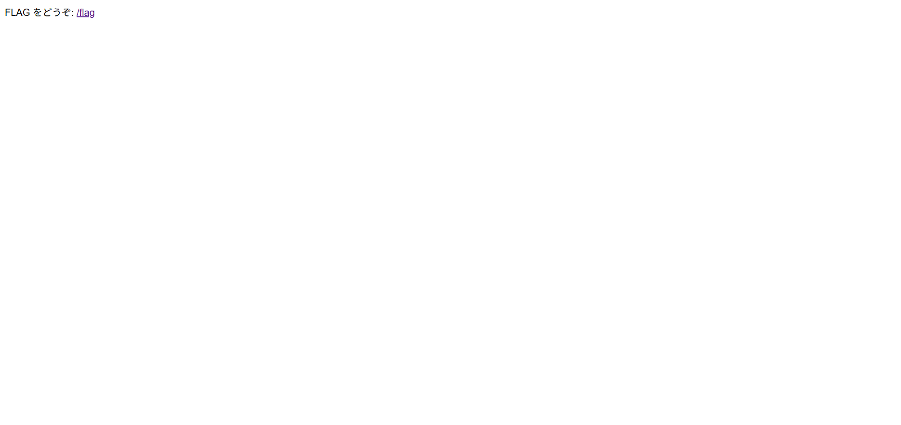

## skipping (100pt / 737 solves)
> `/flag`へのアクセスは拒否されます。curlなどを用いて工夫してアクセスして下さい。 `curl [問題鯖のURL]`

ソースコードが与えられている。  

まず愚直にブラウザでURLにアクセスしてみると、次の一文のみがあった。



問題文通り、`/flag`にアクセスしようとしても403が返ってくるのみ。  
ここでソースコードを見てみる。内容は以下の通り。
```javascript
var express = require("express");
var app = express();

const FLAG = process.env.FLAG;
const PORT = process.env.PORT;

app.get("/", (req, res, next) => {
    return res.send('FLAG をどうぞ: <a href="/flag">/flag</a>');
});

const check = (req, res, next) => {
    if (!req.headers['x-ctf4b-request'] || req.headers['x-ctf4b-request'] !== 'ctf4b') {
        return res.status(403).send('403 Forbidden');
    }

    next();
}

app.get("/flag", check, (req, res, next) => {
    return res.send(FLAG);
})

app.listen(PORT, () => {
    console.log(`Server is running on port ${PORT}`);
});
```

どうやら`/flag`にアクセスするためには`x-ctf4b-request`ヘッダの値が`ctf4b`であれば良いらしい。  
ということでそうなるように`curl`してやると、フラグを取得できた。
```
$ curl [URL] -H 'x-ctf4b-request: ctf4b'
ctf4b{y0ur_5k1pp1n6_15_v3ry_n1c3}
```

### `ctf4b{y0ur_5k1pp1n6_15_v3ry_n1c3}`
