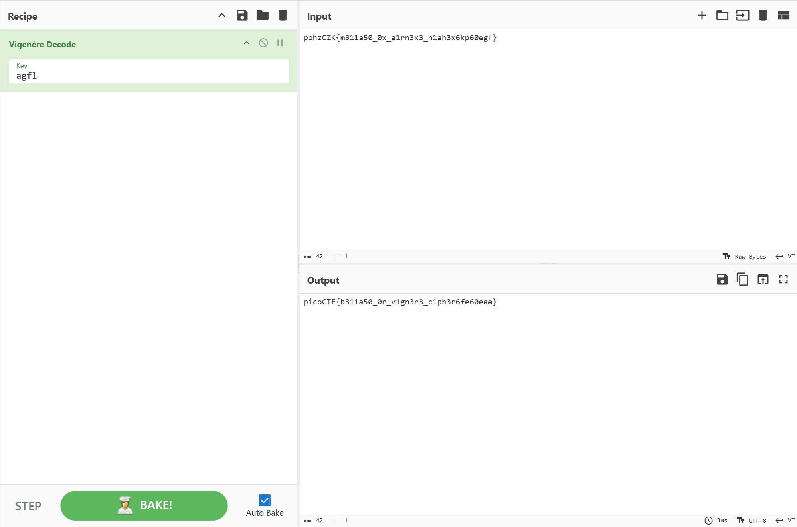

# la cifra de
> I found this cipher in an old book. Can you figure out what it says? Connect with 
`nc (問題鯖のホスト名とポート番号)`.

問題タイトルについて軽く調べてみる。  
la→定冠詞  
cifra→「数」、「形」、「暗号」などの意味を持つ名詞（今回は「暗号」が一番適切か）  
de→「～の」「～から」などの意味を持つ前置詞。今回は前置詞のみがあり、その後に置かれるべき名詞が存在しない  
つまり、直訳すると「～の暗号」という意味になる、と考えられる。スペイン語はさっぱりなので何とも言えないが。  
試しに問題タイトルで検索してみたが、この問題のWriteupがいくつか出てきてネタバレを踏みそうになったのであえなく撤退。  

それはそれとして、提示されたホストにnetcatしてみると、次に示す暗号文が出力された。
```
Encrypted message:
Ne iy nytkwpsznyg nth it mtsztcy vjzprj zfzjy rkhpibj nrkitt ltc tnnygy ysee itd tte cxjltk

Ifrosr tnj noawde uk siyyzre, yse Bnretèwp Cousex mls hjpn xjtnbjytki xatd eisjd

Iz bls lfwskqj azycihzeej yz Brftsk ip Volpnèxj ls oy hay tcimnyarqj dkxnrogpd os 1553 my Mnzvgs Mazytszf Merqlsu ny hox moup Wa inqrg ipl. Ynr. Gotgat Gltzndtg Gplrfdo

Ltc tnj tmvqpmkseaznzn uk ehox nivmpr g ylbrj ts ltcmki my yqtdosr tnj wocjc hgqq ol fy oxitngwj arusahje fuw ln guaaxjytrd catizm tzxbkw zf vqlckx hizm ceyupcz yz tnj fpvjc hgqqpohzCZK{m311a50_0x_a1rn3x3_h1ah3x6kp60egf}

Ehk ktryy herq-ooizxetypd jjdcxnatoty ol f aordllvmlbkytc inahkw socjgex, bls sfoe gwzuti 1467 my Rjzn Hfetoxea Gqmexyt.

Tnj Gimjyèrk Htpnjc iy ysexjqoxj dosjeisjd cgqwej yse Gqmexyt Doxn ox Fwbkwei Inahkw.

Tn 1508, Ptsatsps Zwttnjxiax tnbjytki ehk xz-cgqwej ylbaql rkhea (g rltxni ol xsilypd gqahggpty) ysaz bzuri wazjc bk f nroytcgq nosuznkse ol yse Bnretèwp Cousex.

Gplrfdo’y xpcuso butvlky lpvjlrki tn 1555 gx l cuseitzltoty ol yse lncsz. Yse rthex mllbjd ol yse gqahggpty fce tth snnqtki cemzwaxqj, bay ehk fwpnfmezx lnj yse osoed qptzjcs gwp mocpd hd xegsd ol f xnkrznoh vee usrgxp, wnnnh ify bk itfljcety hizm paim noxwpsvtydkse.
```

ぱっと見は換字式暗号っぽいので、とりあえずその方針で進めてみる。明らかにフラグらしき文字列（`pohzCZK{m311a50_0x_a1rn3x3_h1ah3x6kp60egf}`）は確認できるものの、どんな暗号化方式なのかが分からないため、この時点では手が出しづらい。ただ、平文が`picoCTF`であると推測できる暗号文`pohzCZK`を見てみると、`z`が対応するアルファベットは1種類だけではないことが分かるので、単純な換字式暗号ではなさそうである。  
ここまで来て、私の頭の中にはViginere暗号が浮かんでいた。といってもちゃんとした根拠があるわけでもなく、「換字式暗号問題といえばVigenereでしょ」みたいな軽いノリである。しかしながら、Vigenere暗号なら平字に対していくつかの暗字が対応することもあり得るので、可能性としては無くはない。ということで、ひとまずCyberChefに`pohzCZK{m311a50_0x_a1rn3x3_h1ah3x6kp60egf}`だけを持ってきて、Vigenere方陣とにらめっこしながらとりあえず`picoCTF`が一致するように鍵を求めてみる。すると......


それっぽいものが出来上がる。そして試しにこのフラグを提出してみると、見事に通ってしまった。なんともスッキリしない終わり方なのであった。
### `picoCTF{b311a50_0r_v1gn3r3_c1ph3r6fe60eaa}`
また、求められた鍵から平文全文を求めるための正しい鍵の並びを求めると、`flag`であることが分かった。平文はわざわざ最初から見れるようにしなくても良いかなと思ったので、以下に折り畳み。

<details><summary>平文全文</summary>

```
It is interesting how in history people often receive credit for things they did not create

During the course of history, the Vigenère Cipher has been reinvented many times

It was falsely attributed to Blaise de Vigenère as it was originally described in 1553 by Giovan Battista Bellaso in his book La cifra del. Sig. Giovan Battista Bellaso

For the implementation of this cipher a table is formed by sliding the lower half of an ordinary alphabet for an apparently random number of places with respect to the upper halfpicoCTF{b311a50_0r_v1gn3r3_c1ph3r6fe60eaa}

The first well-documented description of a polyalphabetic cipher however, was made around 1467 by Leon Battista Alberti.

The Vigenère Cipher is therefore sometimes called the Alberti Disc or Alberti Cipher.

In 1508, Johannes Trithemius invented the so-called tabula recta (a matrix of shifted alphabets) that would later be a critical component of the Vigenère Cipher.

Bellaso’s second booklet appeared in 1555 as a continuation of the first. The lower halves of the alphabets are now shifted regularly, but the alphabets and the index letters are mixed by means of a mnemonic key phrase, which can be different with each correspondent.
```
</details>

形はどうあれ問題自体は解けたので、Writeupをいくつか読んでみたが、論理的な根拠をもってこの暗号文をVigenere暗号だと考えているものは（自分の見た限りでは）無く、仮定の下で解き進めているものしかなかった。ヒント2を見る限り、問題タイトルでググって情報を得るのが作問者の想定解だったのだろうか。まあ、わざわざ暗号化方式を導出するために頻度分析とかをやりだすとMediumの域を遥かに超えそうではある。
